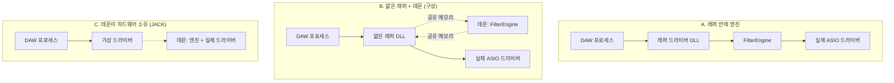
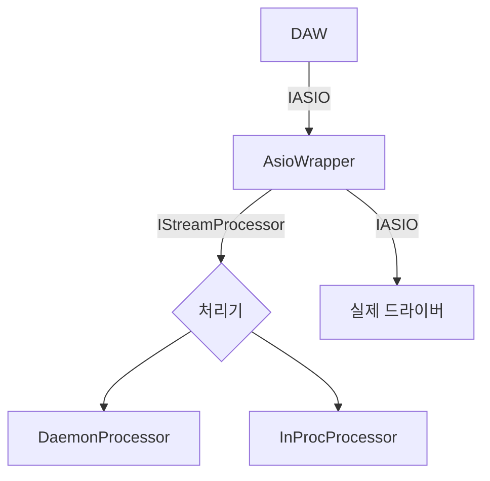
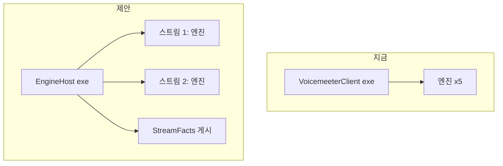
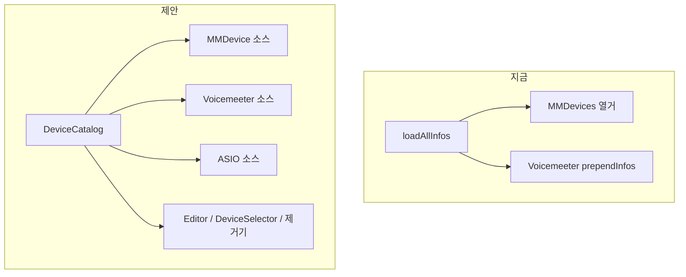

# ASIO 지원 아키텍처 조사

작성일 2026-08-28. 브랜치 `feat/asio-architecture-study`. 코드 인용은 v2.47.1(`df26f9da`) 기준입니다.

이 문서는 "ASIO를 별도 프로세스(데몬)로 처리하되 엔진, config.txt, Editor, DeviceSelector는 그대로 공유한다"는 구상이 현재 코드 구조 위에서 성립하는지 조사한 결과입니다. 결론부터 쓰면 **성립합니다.** 엔진과 장치 기록에는 이미 여러 어댑터가 꽂혀 있는 시임이 있어서, ASIO는 그 시임에 꽂히는 여섯 번째 엔진 호스트이자 네 번째 장치 종류가 됩니다. 새로 지어야 하는 것은 셋뿐입니다. DAW 안에 들어가는 얇은 래퍼 드라이버, 엔진을 품는 데몬, 둘 사이의 실시간 전달 모듈입니다.

용어는 `improve-codebase-architecture` 스킬의 것을 그대로 씁니다. **모듈**은 인터페이스와 구현을 가진 것, **시임**은 인터페이스가 놓이는 자리, **어댑터**는 그 자리를 채우는 구현, **깊이**는 작은 인터페이스 뒤에 많은 동작이 숨은 정도입니다.

---

## 1. 요약

| 항목 | 판정 |
|---|---|
| 엔진 공유 | 가능. `EngineSetup` + `process()`가 이미 호스트 무관 계약이고 어댑터가 5개 있음 |
| config.txt 공유 | 가능. `Device:`는 문자열 3개로 매칭, `Channel:`은 채널 수에서 이름 파생 |
| DeviceSelector/Editor 공유 | 가능. `AbstractAPOInfo` 인터페이스만 쓰며, 열거 훅 한 곳만 하드코딩 |
| 별도 프로세스 | 가능하며 선례 있음. `VoicemeeterClient`가 같은 방식(엔진 N개를 품은 동반 exe) |
| 라이선스 | 걸림 없음. ASIO SDK 2.3.4(2025-10-15)부터 GPLv3 이중 라이선스, 이 저장소는 GPLv2-or-later |
| CI 검증 | 가능. ASIO 드라이버는 유저 모드 in-proc COM DLL이라 가짜 드라이버를 러너에서 그대로 띄울 수 있음 |
| 실측 필요 | 프로세스 간 왕복 지연과 지터. 이것이 데몬 방식의 유일한 실질적 위험 |

---

## 2. 구상이 코드에 어떻게 대응되는가

구상의 문장을 하나씩 코드의 사실에 붙여 보면 다음과 같습니다.

**"ASIO는 오디오 시스템의 구현을 가져와서 서로 다른 구현이 되는 것을 방지"**
엔진의 유일한 진입점은 `EngineSetup` 한 구조체와 `initialize(setup)` 한 호출입니다(`engine/FilterEngine.h:53-80`). APO DLL(`EqualizerAPO/EqualizerAPO.cpp:510-516`), VoicemeeterClient(`VoicemeeterClient.cpp:323-338`), Editor 분석 스레드(`Editor/AnalysisThread.cpp:180-196`), Benchmark, 회귀 테스트가 전부 같은 구조체를 채워 같은 `process()`를 부릅니다. ASIO 호스트도 같은 구조체를 채우면 끝이고, 엔진 코드는 한 줄도 갈라지지 않습니다.

**"ASIO가 불안정해 팅겨도 기존 사운드까지 같이 뒤지는 걸 방지"**
APO는 `audiodg.exe` 안에서 돌고, ASIO 드라이버는 DAW 프로세스 안에서 돕니다. 어느 쪽 설계를 골라도 ASIO 코드는 audiodg에 들어가지 않으므로 시스템 사운드는 자동으로 격리됩니다. 데몬 방식이면 반대 방향도 지켜집니다. 엔진(데몬)이 죽어도 DAW 쪽 래퍼는 통과 모드로 내려가고, DAW가 죽어도 데몬은 그 세션만 정리합니다.

**"별도의 프로세스가 될 것이다", "데몬이 하나니까"**
선례가 `VoicemeeterClient`입니다. 동반 exe 하나가 버스마다 `FilterEngine`을 하나씩(최대 5개) 품고, 각 엔진이 레지스트리 `ConfigPath`의 config.txt를 감시하며, 장치 기록(`VoicemeeterAPOInfo`)의 `install()`은 APO 체인이 아니라 시작 프로그램 바로가기를 고칩니다(`devices/VoicemeeterAPOInfo.cpp:242-283`). ASIO 데몬은 이 패턴의 두 번째 사용자입니다.

**"ASIO 기기는 장치 설치자에서 따로 안내", "Device:로 묶지 않으면 설정을 공유"**
`Device:` 줄은 `연결이름 장치이름 [GUID]` 문자열에 대한 부분 문자열 매칭입니다(`filters/DeviceCommand.cpp:34-65`). ASIO 스트림은 `ASIO <드라이버 이름> {CLSID}`를 내놓으면 됩니다. GUID를 비운 선례(`VoicemeeterAPOInfo.cpp:172-175`)도 있고, 중괄호가 든 단어는 GUID까지 포함해 비교하는 규칙(`DeviceCommand.cpp:32-52`)이 있어 `Device: {CLSID}`도 그대로 동작합니다. `Device:` 줄이 없는 필터는 지금처럼 모든 장치에 적용되고, 그 "모든"에 ASIO 스트림이 들어갑니다.

**"같은 장치 관리자, 같은 에디터"**
DeviceSelector(`DeviceSelector.cpp:170-198`), Editor의 Device 카드(`widgets/cards/DeviceCardEditor.cpp:15-42`), 분석 장치 콤보(`MainWindow.cpp:134-157`), 분석 스레드 모두 `AbstractAPOInfo`의 가상 메서드 19개만 씁니다. 하드코딩된 곳은 열거 함수의 훅 한 줄(`devices/DeviceAPOInfo.cpp:71-72`, `VoicemeeterAPOInfo::prependInfos`)뿐입니다.

---

## 3. 처리가 어디서 도는가: 세 가지 형태

핵심 결정은 하나입니다. `process()`가 어느 프로세스에서 도는가.



| 기준 | A 엔진 in-proc | B 얇은 래퍼 + 데몬 | C JACK형 |
|---|---|---|---|
| 추가 지연 | 0 | 동기면 0 (왕복 수십 µs 대기), 파이프라인이면 버퍼 1개 | 버퍼 1개 이상 |
| 엔진이 남의 프로세스에 들어감 | 예 (위험 목록 4절) | 아니오 | 아니오 |
| 32비트 DAW | 엔진 전체의 Win32 빌드 필요 | 래퍼만 Win32 빌드 | 래퍼만 |
| 데몬 죽으면 | 해당 없음 | 통과 모드 | 소리 끊김 |
| DAW의 장치 소유권 | 유지 | 유지 | 데몬이 가져감 |
| 선례 | FlexASIO류 | JACK Router, Voicemeeter Insert | JACK |
| 판정 | 대체·측정용 | **권장** | 비권장 |

C는 DAW가 인터페이스를 직접 소유한다는 전문가 사용자의 기대와 어긋나고, 샘플레이트 중재와 배타성 문제를 새로 만듭니다. "혁명적일지라도 세상 조용하게"와 반대 방향이라 제외합니다.

A와 B는 래퍼 드라이버 코드가 같고 `process()`의 위치만 다릅니다. 그래서 래퍼 안에 **처리기 시임**을 하나 두면 두 어댑터(in-proc 엔진, 데몬 연결)를 같은 CI로 검증하고, 실제 장치에서 왕복 지연을 재서 최종 판단을 내릴 수 있습니다. 두 어댑터가 실제로 존재하므로 이 시임은 가설이 아니라 실제 시임입니다.

**B의 왕복 지연에 관해.** JACK Router는 드라이버 DLL이 앱 프로세스 안에서 `jack_client_open`으로 서버에 붙고, 서버의 process 콜백이 그대로 ASIO `bufferSwitch`를 부르는 구조입니다(`jack-router/win/JackRouter.cpp:382-386, 430-440`). 버퍼 크기와 샘플레이트는 서버가 정하고 앱은 그 값만 허용합니다(`:512-545`). Windows에서 20년 넘게 이 구조로 64~256프레임 버퍼를 돌려 왔으니, 프로세스 간 동기 전달 자체는 성립합니다. 다만 48 kHz 64프레임은 1.33 ms이고, 그 안에 왕복 신호 두 번과 엔진 처리(convolution 포함)가 들어가야 합니다. 이 값은 실측 항목이며, 데몬 스레드는 `AvSetMmThreadCharacteristics("Pro Audio")`로 올려야 합니다. 동기 모드에는 마감을 두어 늦으면 그 버퍼만 통과시키고(끊김 1회, DAW는 살아 있음), 파이프라인 모드는 버퍼 하나를 더 쓰는 대신 마감이 없습니다. 둘 다 `getLatencies()`에 정직하게 보고합니다.

---

## 4. 엔진을 남의 프로세스에 넣으면 생기는 일 (A를 기본으로 삼지 않는 이유)

엔진 자체는 인스턴스별 상태만 가집니다(VoicemeeterClient가 한 프로세스에 5개를 돌립니다). 문제는 프로세스 전역 상태입니다.

| 전역 상태 | 위치 | DAW 안에서의 위험 |
|---|---|---|
| FFTW 플래너 | `dsp/FftwPlanningPolicy.cpp:15-56` | DAW나 다른 플러그인이 같은 libfftw3를 쓰면 플래너를 공유. 가장 큰 위험 |
| VST 호스트 전역 | `vst/VSTPluginLibrary.cpp:83-125` | DAW 안에서 VST를 다시 호스팅. 같은 플러그인 DLL을 두 호스트가 로드 |
| SEH 삼킴 | `filters/VSTPluginFilter.cpp:498-683` | 오디오 스레드에서 `__except`로 예외를 삼키는 코드가 DAW 스레드에서 돎 |
| Logging | `services/logging/Logging.cpp:33-38` | 프로세스에 하나. 마지막 호출자가 이김 |
| MXCSR FTZ/DAZ | `dsp/MxcsrGuard.h:39-46` | 호출 동안 DAW 스레드의 FP 제어 워드를 바꿈 (복원은 함) |
| 병렬 로더 | `runtime/concurrency/ParallelExecutor.h:29` | 설정 로드 때 스레드 풀 생성 |

B에서는 이 모두가 데몬 안에 갇힙니다. A를 어댑터로 유지하는 이유는 측정과 CI 비교용이지, 배포용이 아닙니다.

---

## 5. 후보 카드

### C1. AsioWrapper: 래퍼 드라이버 모듈과 처리기 시임

**강도: Strong**

**파일:** 신규 `asio/` (드라이버 DLL 프로젝트 `EqualizerAPOAsio`), `services/registry/ClsidRegistration.h` 재사용, `Common.lib` 링크 없음(얇은 래퍼일 때).

**문제.** ASIO 코드가 없습니다(저장소 전체에서 `ASIO`는 vendored 헤더 두 곳뿐). 그리고 "in-proc이냐 데몬이냐"는 논쟁으로는 정해지지 않고 실측으로만 정해집니다.

**해법.** DAW 쪽으로는 `IASIO`를 구현하고 하드웨어 쪽으로는 실제 드라이버를 호스팅하는 래퍼 모듈 하나. 그 안에 처리기 시임 `IStreamProcessor { prepare(format); process(in, out, frames); release(); }`를 두고 어댑터 둘을 꽂습니다. `DaemonProcessor`(공유 메모리로 데몬에 전달)와 `InProcProcessor`(엔진 직접 링크, 측정·CI 비교용). 데몬이 없거나 마감을 넘기면 통과.

등록은 "실제 드라이버마다 래퍼 항목 하나"로 합니다. `HKLM\SOFTWARE\ASIO\<드라이버 이름> (EQ APO XT)` 아래 새 CLSID를 만들고, 그 CLSID의 `InprocServer32`를 우리 DLL로, `HKLM\SOFTWARE\EqualizerAPO\ASIO\{CLSID}`에 대상 드라이버 CLSID를 적습니다. `DllGetClassObject`는 이 표를 보고 대상 드라이버를 고릅니다. 이렇게 하면 DAW의 드라이버 목록에 같은 장치 이름이 접미사만 달고 나타나고, DeviceSelector의 설치 체크박스가 그 항목을 만들고 지우는 일이 되어 지금의 설치 의미와 정확히 겹칩니다. `controlPanel()`은 실제 드라이버의 패널을 엽니다.

**이점.** 로컬리티: ASIO 프로토콜(버퍼 스위치, 리셋 요청, 샘플레이트 변경, 지연 보고)이 한 모듈에 모입니다. 레버리지: 처리기 시임 하나로 in-proc과 데몬을 같은 테스트로 비교합니다. 테스트: 가짜 드라이버를 감싼 래퍼를 콘솔 호스트가 구동하면 레지스트리 없이도 프로토콜 전체가 러너에서 돕니다(C6).



### C2. EngineHost 데몬: 엔진을 품는 하나의 프로세스

**강도: Strong**

**파일:** 신규 `EqualizerAPOHost/` (exe), `VoicemeeterClient/VoicemeeterClient.cpp:323-338`의 N-엔진 패턴 재사용, `services/install/ApoRegistration.cpp`(설치 시 배치).

**문제.** 엔진이 DAW 안에 들어가면 4절의 전역 상태가 남의 프로세스와 섞입니다. 32비트 DAW는 엔진 전체의 Win32 빌드를 요구합니다(CI는 지금 Win32를 빌드하지 않습니다).

**해법.** 사용자 세션당 하나의 데몬. 래퍼가 붙을 때 세션 이름의 이벤트가 없으면 설치 폴더의 exe를 띄우고(온디맨드), 마지막 스트림이 떠나면 잠시 후 종료합니다. 스트림마다 `FilterEngine` 하나(출력 방향; 입력 방향은 `capture=true`인 두 번째 엔진으로 나중에), `EngineSetup`은 `deviceName=드라이버 이름, connectionName=L"ASIO", deviceGuid=CLSID, sampleRate/maxFrameCount=드라이버 값, channelMask=0(채널 수에서 파생)`. `customPath`는 비워 두어 레지스트리 `ConfigPath`와 감시 스레드를 그대로 씁니다. 리셋 요청이 오면 스트림을 멈추고 재`initialize`합니다(엔진은 재초기화를 지원하되 `process()`와 겹치면 안 됩니다, `FilterEngine.cpp:120`).

**이점.** 로컬리티: ASIO 스트림의 수명(붙음, 리셋, 떠남, 죽음)이 한 프로세스의 한 표에 모입니다. 레버리지: 32비트든 ARM64든 DAW가 무엇이든 엔진 빌드는 하나입니다. 격리: 데몬이 죽으면 래퍼는 통과, DAW가 죽으면 데몬은 세션 정리.



### C3. StreamRing: 실시간 프로세스 간 전달 모듈

**강도: Strong** (B를 택하면 필수)

**파일:** 신규 `runtime/ipc/StreamRing.{h,cpp}` (Qt 없음, Win32 공유 메모리 + 이벤트), `engine/ConfigSwapChannel.h`가 설계 선례.

**문제.** 공유 메모리에 버퍼를 놓고 신호를 주고받고 마감을 재는 코드는 흩어지기 쉽고, 흩어지면 ARM64 메모리 순서 결함처럼 찾기 어려운 버그가 됩니다(이 저장소가 `ConfigSwapChannel`을 만든 이유와 같습니다).

**해법.** 인터페이스를 넷으로 제한합니다. `Producer::publish(frames, deadline)`, `Producer::wait() -> Done | Late | Gone`, `Consumer::acquire()`, `Consumer::release()`. 안에 이중 버퍼, 세션 헤더(샘플레이트, 채널 수, 프레임 수, 세대 번호), 상대 프로세스 사망 감지(프로세스 핸들 대기)를 숨깁니다. 데이터 형식은 float32 인터리브 하나로 고정하고 변환은 래퍼가 맡습니다(ASIO 샘플 형식은 드라이버마다 다르며 SDK의 `ASIOConvertSamples`가 있습니다).

**이점.** 테스트: 스레드 두 개로 프로세스 없이 검증됩니다(`Late`, `Gone`, 세대 교체). 로컬리티: 메모리 순서 결정이 한 파일에 모입니다. 레버리지: 같은 링을 나중에 Editor의 실시간 미터 같은 데에 다시 쓸 수 있습니다.

### C4. DeviceCatalog: 장치 열거 시임을 깊게

**강도: Strong**

**파일:** `devices/DeviceAPOInfo.cpp:53-75`, `devices/VoicemeeterAPOInfo.cpp`(prependInfos), `Editor/MainWindow.cpp:84-85`, `DeviceSelector/DeviceSelector.cpp:44-53`, `services/install/ApoRegistration.cpp:226-255`.

**문제.** `loadAllInfos()`가 MMDevices 열거와 `VoicemeeterAPOInfo::prependInfos` 호출을 하드코딩합니다. 장치 종류가 셋이 되면 "어떤 종류가 있는가"가 이 함수와 호출자 셋에 흩어집니다. 삭제 검사를 하면 복잡도가 호출자로 되돌아가므로 이 모듈은 제 몫을 합니다.

**해법.** `DeviceCatalog::load(IRegistry&) -> {playback, capture}`가 소스 목록(MMDevice, Voicemeeter, ASIO)을 소유합니다. `AsioAPOInfo`는 `AbstractAPOInfo`의 네 번째 어댑터로, `HKLM\SOFTWARE\ASIO`를 `IRegistry::enumSubKeys/readValue`로 읽어(우리 래퍼 항목은 제외) 실제 드라이버마다 기록 하나를 만듭니다. `isInstalled()`는 래퍼 항목의 존재, `install()/uninstall()`은 그 항목의 생성·삭제(C1의 등록표), `getDeviceString()`은 `ASIO <이름> {CLSID}`. `ApoRegistration::uninstallAllDeviceApos()`는 카탈로그가 돌려주는 것을 그대로 훑으므로 제거 범위가 저절로 넓어집니다.

**이점.** 로컬리티: 새 장치 종류가 파일 하나 추가로 끝납니다. 테스트: `FakeRegistry`에 `HKLM\SOFTWARE\ASIO\*`를 심으면 `EngineOrchestrationTests`가 열거·설치·제거를 PR마다 검증합니다. Editor Device 카드와 DeviceSelector는 인터페이스만 쓰므로 변경이 없고, `getStateText()`의 종류별 분기(`DeviceSelector.cpp:637-639`)에 "ASIO" 표시 한 줄만 붙습니다.



### C5. StreamFacts: 호스트가 게시하는 스트림 사실

**강도: Worth exploring**

**파일:** `devices/AbstractAPOInfo.h:34-36`, `Editor/AnalysisThread.cpp:143-162`, `services/audio/AudioFormatProbe.cpp:41-56`, `devices/VoicemeeterAPOInfo.cpp:51-52, 420-431`(HKCU `sampleRate` 선례).

**문제.** 장치 기록의 채널 수·샘플레이트·마스크는 MMDevice 속성 저장소에서 옵니다. ASIO는 드라이버를 COM으로 띄워야 채널 수를 알 수 있고, 드라이버에 따라서는 열거만으로 하드웨어를 잡거나 대화상자를 띄웁니다. 분석 스레드는 값이 0이면 8채널 7.1/48 kHz로 되돌아가는데(`AnalysisThread.cpp:154-162`), 스테레오 인터페이스에 7.1 분석은 틀린 그림입니다. 툴바 배지의 `AudioFormatProbe`도 MMDevice 전용이라 ASIO에는 `Unknown`입니다.

**해법.** 엔진을 실제로 돌리는 호스트(데몬)가 마지막으로 본 사실(샘플레이트, 채널 수, 버퍼 크기, 활성 여부, 최근 늦음 횟수)을 `HKCU\SOFTWARE\EqualizerAPO\ASIO\{CLSID}`에 적고, `AsioAPOInfo`가 그것을 읽어 인터페이스 값으로 내놓습니다. Voicemeeter가 `sampleRate` 하나로 이미 하는 일을 표로 넓힌 것입니다.

**이점.** 분석 그래프가 실제 스트림 형식으로 그려지고, 배지가 "ASIO 스트림 활성 · 64프레임"을 보여 줄 수 있습니다. 제한: 드라이버를 한 번도 붙이지 않은 장치는 여전히 모르는 값이며, 이 경우 UI는 "아직 스트림 없음"이라고 써야 합니다.

### C6. FakeAsioDriver + AsioProbe: CI 검증 사다리

**강도: Strong** (요구 조건)

**파일:** 신규 `Tests/FakeAsioDriver/`(IASIO를 구현한 in-proc COM DLL, 결정적 신호 생성 + 루프백), 신규 `Tests/AsioProbe/`(콘솔 호스트, `Tests/VstPreviewProbe`가 본), `.github/scripts/Build-Solution.ps1:12-37`, `Tests/Tests.props`.

**문제.** 가짜 드라이버가 없으면 ASIO에 관한 어떤 것도 러너에서 검증되지 않습니다. 실제 드라이버는 하드웨어를 요구합니다.

**해법.** 네 단으로 나눕니다.

| 단 | 내용 | 실행 시점 |
|---|---|---|
| 1 | `FakeRegistry`에 `HKLM\SOFTWARE\ASIO\*`를 심고 카탈로그 열거·설치·제거 검증 | 모든 PR |
| 2 | `--skin-shots`/갤러리에 ASIO 항목이 든 DeviceSelector·Device 카드 캡처 | 모든 PR |
| 3 | AsioProbe가 래퍼 DLL과 FakeAsio DLL을 `DllGetClassObject`로 직접 로드(레지스트리 불필요), 설정을 걸고 출력이 `AudioRegressionTests` 참조와 SHA-256으로 같은지 검증. in-proc 어댑터와 데몬 어댑터 둘 다 | 모든 PR (avx2) |
| 4 | 데몬 어댑터로 64/128/256프레임에서 N초 구동, `Late` 횟수와 왕복 시간 분포 기록 | dispatch 전용, 정보성 |

4단을 차단 게이트로 두지 않는 이유는 공유 러너의 스케줄링 지터가 실제 기기와 무관하기 때문입니다. 3단은 프로토콜 정확성이라 차단 게이트로 둡니다.

**이점.** 가짜 드라이버는 유저 모드 DLL이라 Scream 커널 드라이버 레시피(`audio-live-repro.yml:167-230`)와 달리 서명도 devcon도 필요 없습니다. 레지스트리 어휘는 `ApoEndpointHarness.psm1`처럼 PowerShell과 C++가 한 표를 공유하게 둡니다.

### C7. EngineProcessContext: 남의 프로세스 안 엔진 위생

**강도: Speculative** (in-proc 어댑터를 배포할 때만)

**파일:** `dsp/FftwPlanningPolicy.cpp`, `services/logging/Logging.cpp`, `vst/VSTPluginLibrary.cpp`.

**문제.** 4절의 전역 상태는 데몬 안에서는 문제가 없지만, in-proc 어댑터를 실제 배포하려면 FFTW 플래너 공유와 중첩 VST 호스팅을 정리해야 합니다.

**해법.** 지금은 하지 않습니다. 실측에서 데몬 왕복이 허용치를 넘어 in-proc이 필요해질 때만, 프로세스 전역 상태를 한 컨텍스트 객체로 모으는 작업을 엽니다.

---

## 6. 라이선스와 이름

ASIO SDK 2.3.4(2025-10-15)부터 SDK 전체가 Steinberg 독점 라이선스 또는 GPLv3 중 선택입니다(`LICENSE.txt` 9-12행: "licensed under the terms of the Steinberg ASIO License, or alternatively under the terms of the General Public License (GPL) Version 3"). 이 저장소의 소스 헤더는 GPLv2 "or (at your option) any later version"이므로 결합물은 GPLv3로 배포하면 되고, Highway(Apache-2.0/BSD-3), FFTW(GPLv2+), libsndfile(LGPL), muparserx(BSD)는 모두 GPLv3와 결합 가능합니다. 릴리스 노트와 About에 GPLv3 결합 사실을 적어야 합니다.

SDK는 저장소에 넣지 않고 `vst3_pluginterfaces`처럼 빌드 시점에 받습니다. `https://www.steinberg.net/asiosdk`가 `download.steinberg.net/sdk_downloads/ASIO-SDK_2.3.4_2025-10-15.zip`(8.9 MB, SHA-256 `d5ebf0c20dd2c5f43771fd0c1418f4b361bf52434ee670097cfa6b3a335e2eca`)로 302 리다이렉트되며 인증이 없습니다. `simd-variants.psd1`의 `DependencyReleases` 표에 핀을 추가하면 됩니다. 필요한 파일은 `common/asio.h, iasiodrv.h, asiodrvr.h, combase.*, dllentry.cpp, register.cpp`와 `host/asiodrivers.*, host/pc/asiolist.*`입니다.

상표 규칙(SDK `README.md`)은 제품·회사 이름에 "ASIO"를 넣는 것을 금합니다. 드라이버 항목 이름은 `<실제 드라이버 이름> (EQ APO XT)`처럼 우리 쪽 접미사에 ASIO를 넣지 않는 형태여야 하고, 로고를 쓰려면 SDK의 사용 지침을 따릅니다.

---

## 7. 확인하지 못한 것과 열린 질문

확인하지 못한 것은 넷입니다. 실제 DAW(Cubase, Reaper, foobar2000 ASIO 출력)에서의 호환성, 실제 기기에서의 왕복 지연 분포, 32비트 DAW의 수요, 그리고 ASIO 입력(캡처) 방향의 필요성입니다. 앞의 둘은 사용자의 ASIO 기기로 실측해야 하고, 뒤의 둘은 결정 사항입니다.

열린 질문은 다음과 같습니다.

1. 데몬 수명: 온디맨드(래퍼가 띄우고 유휴 시 종료)와 로그온 자동 시작 중 어느 쪽인가. 온디맨드를 권합니다.
2. 32비트 DAW 지원 여부. 지원하면 래퍼만 Win32로 한 번 더 빌드하는 CI 레그가 늘어납니다(엔진은 아님).
3. 등록 방식: 실제 드라이버마다 래퍼 항목(권장, 설치 체크박스와 일대일) 대 "Equalizer APO XT" 항목 하나에 대상 선택.
4. 첫 릴리스 범위: 출력 방향만(권장) 대 입출력 모두.
5. 동기 모드의 마감을 넘겼을 때의 정책: 그 버퍼 통과(권장) 대 마지막 처리 결과 반복.

---

## 8. 최우선 권고

**C1 + C6를 먼저 합니다.** 래퍼 드라이버와 가짜 드라이버·프로브를 같이 지으면, 데몬이 생기기 전에 ASIO 프로토콜 전체(버퍼 스위치, 리셋, 샘플레이트 변경, 지연 보고)가 PR마다 검증되는 상태가 됩니다. 처리기 시임에 in-proc 어댑터를 먼저 꽂으면 그 시점에 이미 실제 기기에서 소리를 들을 수 있고, 그다음 C3(StreamRing)를 스레드 테스트로 굳힌 뒤 C2(데몬)를 얹어 두 어댑터의 왕복 지연을 같은 프로브로 비교합니다. C4(DeviceCatalog)는 C2와 독립이라 병렬로 진행할 수 있으며, C5는 C2가 사실을 게시하기 시작한 뒤에 붙입니다.

순서를 이렇게 잡는 이유는 위험이 한 곳에 있기 때문입니다. 나머지는 이미 있는 시임에 어댑터를 꽂는 일이고, 프로세스 간 왕복만이 측정 전에는 아무도 답할 수 없는 항목입니다. 그것을 재는 도구를 먼저 만드는 것이 가장 짧은 길입니다.

---

## 9. 결정 (2026-08-28)

메인테이너의 답을 그대로 적고, 설계에 미치는 결과를 붙입니다.

| 질문 | 결정 | 설계 결과 |
|---|---|---|
| 데몬 수명 | 온디맨드는 "EQ APO를 쓸 때처럼 음질 드리프트를 느끼지 못할 것이 확실할 때만". 아니면 로그온 자동 실행 | 아래 판정 참조. 온디맨드 + 준비 장벽 + 유휴 유예로 확정하되, "첫 버퍼부터 필터됨"을 게이트가 증명한다 |
| 32비트 DAW | 지원 | 래퍼 DLL은 Win32/x64/ARM64 빌드, 데몬은 x64/ARM64. 프로토콜은 비트 폭 고정·포인터 없음. CI에 Win32 래퍼+가짜 드라이버+프로브 레그 추가 |
| 장치 목록 | 기존 재생/캡처 분류만 유지한 채 나열. ASIO는 2등 시민이 아니며 별도 그룹(그러면 default가 생김) 없이 혼동 방지용 최소 표식만 | ASIO 드라이버는 재생 기록 하나, 캡처 기록 하나로 각 그룹에 들어간다(USB 인터페이스가 MMDevice에 렌더/캡처 엔드포인트로 따로 보이는 것과 같은 모양). 표식은 행 머리의 `ASIO` 한 단어뿐이고, 상태 문구에는 되풀이하지 않는다(엔드포인트 행의 연결 이름 자리). `isDefaultDevice()`는 항상 거짓 |
| 첫 릴리스 범위 | 쪼개지 않고 전부 개발한 뒤 엄격한 테스트를 통과해야 릴리스. 입출력 전체 | 기능 브랜치 `feat/asio`에 단계별 PR을 쌓고, 릴리스는 마지막에 한 번. 재생 기록의 설치=출력 방향 처리, 캡처 기록의 설치=입력 방향 처리 |
| 동기 마감 초과 | 그 버퍼를 통과시킨다. 너무 많으면 테스트 실패("작동 안 하는 쓰레기") | 늦은 버퍼는 세고 게시한다. 실기기 게이트: 기준 설정·기본 버퍼 크기·10분 구동에서 늦은 버퍼 0. CI 결정적 모드: 늦은 버퍼 0 + SHA-256 일치가 차단 게이트 |

**데몬 수명 판정.** APO에서 소리가 처음부터 필터되는 이유는 `LockForProcess` 안에서 `initialize()`가 설정을 동기적으로 읽고, 첫 로드는 크로스페이드를 건너뛰기 때문입니다(`FilterEngine.cpp:193-208`). 온디맨드 데몬도 같은 자리에서 같은 일을 하면 됩니다. 래퍼가 `createBuffers()` 안에서 데몬을 띄우고 설정 로드가 끝나 "준비됨"을 받을 때까지 돌아오지 않으면, DAW가 `start()`를 부르는 순간 첫 버퍼는 이미 필터된 상태입니다. 데몬에 닿지 못하면 조용히 통과시키지 않고 `ASE_HWMalfunction`으로 DAW에 크게 알립니다. 유일한 차이는 DAW의 오디오 시작이 설정 로드 시간(큰 IR이면 수 초)만큼 늦어지는 것인데, 이는 APO가 `LockForProcess`에서 치르는 비용과 같은 것입니다. 마지막 스트림이 떠난 뒤 데몬은 잠시(60초) 남아 DAW의 버퍼 크기 변경 같은 재시작을 흡수합니다. 그래서 온디맨드로 갑니다. 이 조건은 프로브가 "첫 버퍼 하나만의 SHA-256"으로 매 PR 증명합니다. 증명이 깨지면 로그온 자동 실행으로 바꿉니다.

**32비트 뷰.** `IRegistry`는 항상 64비트 뷰로 열지만(`KEY_WOW64_64KEY`), 32비트 호스트가 읽는 `HKLM\SOFTWARE\WOW6432Node\ASIO`와 `HKLM\SOFTWARE\Classes\WOW6432Node\CLSID`는 64비트 뷰에서 실제 키로 보입니다. 경로를 그대로 적으면 되므로 포트 계약을 바꾸지 않습니다.

---

## 10. 1단계 인터페이스 설계: C1 래퍼 + 처리기 시임

같은 문제를 서로 다른 제약으로 네 번 설계했습니다(최소 인터페이스, 유연성 극대화, 공통 호출자 우선, 포트·어댑터). 넷이 합의한 것과 갈린 것을 먼저 적습니다.

**넷이 합의한 것.** 처리기 시임은 ASIO도 COM도 Qt도 모르는 순수 인터페이스이고, 어댑터는 데몬·in-proc·통과 셋이다. 엔진은 대상 드라이버의 **물리 채널 전체**를 본다(DAW가 일부 채널만 열어도 `Channel:` 이름이 움직이지 않도록). 시임의 샘플 형식은 float32 하나이며 변환은 래퍼 가장자리의 일이다. 샘플레이트 변경은 래퍼가 DAW에 `kAsioResetRequest`를 보내 표준 재시작 경로로 몰아넣는다(엔진을 잘못된 레이트로 돌리느니 재시작이 낫다). `outputReady()`를 부르는 호스트는 그 시점에, 안 부르는 호스트는 콜백 복귀 시점에 출력을 처리한다. 콜백에 컨텍스트 포인터가 없어서 트램폴린 표가 필요하다.

**갈린 것과 채택.**

| 쟁점 | 안들 | 채택 |
|---|---|---|
| 시임 크기 | 3개(open/process/close) 대 6개(+hot-swap 슬롯, 통계, 이름) 대 submit/collect 분리 | **3개.** 핫스왑과 채널 마스크는 지금 어댑터가 둘 이상 없으니 가설 시임이다. 통계는 close에 넘긴다 |
| 재구성 | `reconfigure(sampleRate)` 제공 대 "없음: 모든 변경은 close+open" | **없음.** 첫 open과 이후 open이 같은 코드 경로라 순서 버그 한 종류가 통째로 사라진다 |
| 블록 배치 | 인터리브 대 평면(planar) | **평면.** ASIO 원형이 평면이고 엔진에 `process(float**, float**)`가 있다(VoicemeeterClient가 쓰는 오버로드). 제자리 처리는 읽기가 먼저 끝나므로 안전(`FilterEngine.Process.cpp:235-259`) |
| DAW에 보이는 샘플 형식 | 항상 Float32LSB(DAW 버퍼가 곧 스테이징) 대 대상 드라이버 값 그대로 | **그대로.** 변환 한 번 더가 붙지만 DAW가 보는 장치가 바뀌지 않는다("세상 조용하게") |
| 대상 드라이버 포트 | `IAsioTarget`(COM 없는 사본) 대 `IASIO` 자체 | **`IASIO` 자체.** SDK vtable이 이미 인터페이스이고, 가짜 드라이버 클래스를 정적으로 링크하면 COM 없이도 코어를 단위 테스트할 수 있다 |
| in-proc 어댑터 위치 | 래퍼 DLL 안(x64) 대 사이드카 DLL 대 프로브 안에만 | **프로브 안에만.** 배포 DLL은 데몬·통과 둘만 품어 얇게 유지. 프로브는 `--target-clsid`로 실제 드라이버도 열 수 있어 실기기에서 두 어댑터의 왕복을 같은 도구로 잰다 |
| 설정 전달 | 값 하나(`StreamOptions`) 대 흩어진 인자 | **값 하나.** 레지스트리와 argv가 같은 구조체를 채운다 |
| 레지스트리 뷰 | `RegistryView` 포트 확장 대 경로 명시 | **경로 명시**(9절) |

### 10.1 채택 인터페이스

```cpp
// asio/StreamProcessor.h  (Windows 헤더 없음, Common.lib 없음)
namespace eapo::asio {

enum class Direction : uint32_t { Output = 0, Input = 1 };
enum class Mode : uint32_t { Sync = 0, Pipelined = 1 };

// 고정 폭, 포인터 없음: 데몬 프로토콜의 세션 헤더에 그대로 복사된다.
struct StreamFormat
{
    double   sampleRate;
    uint32_t frames;            // ASIO 버퍼 크기. 모든 process()는 정확히 이만큼
    uint32_t channels[2];       // 방향별 물리 채널 수. 0 = 그 방향 비활성
    Mode     mode;
    uint32_t deadlineUs;        // Sync: 핸드오프 하나의 마감. 0 = 자동(주기의 25%)
    char16_t deviceName[64];    // 대상 getDriverName() -> EngineSetup.deviceName
    char16_t deviceGuid[40];    // {대상 CLSID}          -> EngineSetup.deviceGuid
    // connectionName은 상수 u"ASIO". Device: 줄은 "ASIO <name> {clsid}"와 매칭
};

enum class Outcome : uint32_t { Processed, Late, Gone, Off };

struct StreamStats            // 콜백 스레드만 쓴다. close()로 넘겨 게시
{
    uint64_t blocks[2], late[2], gone[2];
    uint32_t maxWaitUs[2], lastWaitUs[2];
    uint32_t staleBlocks;     // sampleRateDidChange 뒤 재시작 전까지 통과시킨 블록
};

struct OpenReport
{
    enum class Status : uint32_t { Ok, Unavailable, Rejected } status;
    float**  planes[2];       // 방향별 채널 포인터 배열, frames 길이 float32. open~close 사이 유효
    uint32_t extraLatencyFrames;   // Sync 0, Pipelined frames. getLatencies에 방향별로 더한다
    char     message[124];    // Ok가 아닐 때 getErrorMessage로 나간다
};

class IStreamProcessor
{
public:
    virtual ~IStreamProcessor() = default;
    // DAW 제어 스레드. 첫 process()를 설정이 로드된 엔진으로 처리할 수 있을 때까지
    // (준비 장벽) 또는 포기할 때까지 막는다. init() 단계에서는 절대 부르지 않는다
    // (DAW는 목록만 보려고 모든 드라이버를 init한다).
    virtual OpenReport open(const StreamFormat& format, const StreamOptions& options) = 0;
    // 대상 드라이버의 bufferSwitch 스레드. 방향당 한 번. planes[d]를 제자리에서 바꾼다.
    //   Processed -> planes[d]에 쓸 소리가 있다(Pipelined: 직전 블록의 결과)
    //   Late/Gone/Off -> 내용 미정. 호출자는 원본을 그대로 쓴다(=통과)
    // 할당, C++ 락, 예외 금지. 커널 객체 대기는 마감 안에서 허용.
    virtual Outcome process(Direction d) noexcept = 0;
    // 제어 스레드. 대상의 disposeBuffers()가 돌아온 뒤(콜백이 더 올 수 없음). 멱등.
    virtual void close(const StreamStats& stats) noexcept = 0;
};

struct StreamOptions          // 레지스트리(HKLM\SOFTWARE\EqualizerAPO\ASIO\{ourClsid})와 argv가 같은 값을 채운다
{
    bool     processOutput = true, processInput = true;
    Mode     mode = Mode::Sync;
    uint32_t deadlineUs = 0;             // 0 = 자동
    uint32_t readyTimeoutMs = 20000;     // 설정 로드에 IR이 들어갈 수 있다
    uint32_t lingerMs = 60000;           // 마지막 스트림 뒤 데몬 잔류
    std::wstring configPath;             // 비면 레지스트리 ConfigPath + 감시(운영)
    std::wstring daemonExePath;          // 비면 <래퍼 DLL 폴더>\EqualizerAPOHost.exe
    std::wstring daemonEndpoint;         // 비면 세션별 자동. 프로브는 고정 이름을 준다
};
}
```

```cpp
// asio/AsioWrapper.h  - 래퍼 모듈. 공개 표면은 생성자 하나 + IASIO
class AsioWrapper final : public IASIO
{
public:
    AsioWrapper(IASIO& target, StreamOptions options, std::unique_ptr<eapo::asio::IStreamProcessor> processor);
    // IASIO 21개: init, createBuffers, disposeBuffers, start, getLatencies, outputReady,
    // getErrorMessage, getDriverName만 우리가 처리하고 나머지는 대상에 그대로 전달
};
// DLL: DllGetClassObject(rclsid) -> HKLM\SOFTWARE\EqualizerAPO\ASIO\{rclsid}에서 TargetClsid/옵션을 읽고
//      CoCreateInstance(target, NULL, CLSCTX_INPROC_SERVER, target /*IID==CLSID*/, &p),
//      processor = (processOutput || processInput) ? DaemonProcessor : PassthroughProcessor
// 프로브: C export EapoAsioCreate(IASIO* target, const StreamOptions*, IStreamProcessor*, IASIO**)
```

**상태 기계(제어 스레드).** `Loaded → init → Initialized → createBuffers → Prepared → start → Running → stop → Prepared → disposeBuffers → Initialized`. 순서 밖의 호출은 `ASE_InvalidMode`이고 대상에 전달하지 않는다. `createBuffers`는 대상의 `createBuffers`를 먼저 성공시켜 채널 수, 레이트, 버퍼 크기를 확정한 뒤 `open()`을 부르고, 실패하면 대상 버퍼를 해제하고 `ASE_HWMalfunction`을 돌려준다. `start()`는 `open` 뒤 데몬이 죽었는지 다시 확인한다.

**주기당 순서(콜백 스레드, Sync).** 대상 입력 버퍼[i] → float 평면 → `process(Input)` → DAW 입력 버퍼[i] → DAW `bufferSwitch(i)` → DAW 출력 버퍼[i] → 평면 → `process(Output)` → 대상 출력 버퍼[i] → (DAW가 우리 `outputReady`를 불렀으면) 대상 `outputReady()`. 양방향이면 왕복 둘, 출력만이면 하나. Pipelined는 직전 블록의 결과를 먼저 회수해(대기 0) 이번 블록을 넘기며 방향당 정확히 `frames`의 지연이 붙고 `getLatencies`가 그렇게 보고한다.

**실패 모드.** `Late`/`Gone`이면 평면을 버리고 원본을 그대로 옮긴다(=통과). `Gone`은 다음 `createBuffers`까지 고정이며 콜백 스레드는 재접속을 시도하지 않는다. `sampleRateDidChange`는 전달한 뒤 래퍼가 `kAsioResetRequest`를 보내고, DAW가 재시작할 때까지의 블록은 `staleBlocks`로 세며 통과시킨다. `kAsioResetRequest`/`kAsioLatenciesChanged`/`kAsioResyncRequest`/`kAsioOverload`는 그대로 전달, `kAsioSupportsTimeInfo`는 DAW의 답을 그대로 돌려주어 `bufferSwitch`/`bufferSwitchTimeInfo` 선택이 DAW를 따른다. DSD 샘플 형식은 `createBuffers`에서 `ASE_InvalidMode`.

**스레드 규칙.**

| 호출자 | 호출 | 막힘 |
|---|---|---|
| DAW 제어 스레드 | IASIO 전부, `open`/`close`, 데몬 기동 | `readyTimeoutMs`까지 |
| 대상의 bufferSwitch 스레드 | 변환, `process`, DAW 콜백, `outputReady` | `process` 안의 마감까지만 |
| 대상의 알림 스레드 | `sampleRateDidChange`, `asioMessage` 전달 | 없음(플래그만) |
| 데몬 서빙 스레드(MMCSS Pro Audio) | `acquire` → 엔진 ×2 → `release` | work 이벤트 |

### 10.2 데몬 쪽: StreamRing과 EngineHostCore

`DaemonProcessor::open()`은 `IHostLink`(어댑터 둘: `Win32HostLink`=실제 exe 찾기/띄우기 + 이름 있는 매핑과 이벤트, `ThreadHostLink`=같은 프로세스의 스레드에서 `EngineHostCore` 구동)로 링을 만들고 헤더에 `StreamFormat`을 적은 뒤 `Ready`를 기다린다.

```cpp
// runtime/ipc/StreamRing.h  - 양쪽이 같은 소스로 컴파일. Win32/x64/ARM64 바이트 동일
struct alignas(64) RingHeader
{
    uint32_t magic, layoutVersion, totalBytes, slotStride;
    eapo::asio::StreamFormat format;         // 고정 폭이라 그대로 들어간다
    uint32_t wrapperPid, daemonPid;
    uint32_t state;                          // Announced, Ready, Running, Closing, Fault (release/acquire)
    uint32_t sequence;                       // 생산자: 마지막 게시(1부터)
    uint32_t completed;                      // 소비자: 마지막 완료
    uint32_t directionMask;                  // 마지막 게시의 방향
    uint8_t  reserved[...];                  // sizeof == 512, static_assert로 오프셋 고정
};
// 배치: [RingHeader][슬롯0: out 평면들 | in 평면들][슬롯1: ...]  각 블록 64바이트 정렬
```

생산자 `publish(seq)`는 `sequence`를 release 저장하고 work 이벤트를 켠다. `wait(seq, budget)`은 `{done, peerProcess}`를 함께 기다려 `completed == seq`면 `Done`, 시간 초과면 `Late`, 상대 프로세스 핸들이 신호되거나 `state`가 `Fault/Closing`이면 `Gone`이다. 슬롯은 둘이고 생산자는 `completed >= seq-1`일 때만 게시하므로 늦은 블록이 다음 블록과 충돌하지 않는다. 소비자는 게시된 순서를 전부 처리해(생산자가 이미 포기했더라도) IIR 상태를 끊지 않는다.

`EngineHostCore::serve(RingConsumer&)`는 헤더를 한 번 읽어 `EngineSetup` 둘(출력: `capture=false`, 입력: `capture=true`; `channelMask=0`, `maxFrameCount=frames`, `connectionName=L"ASIO"`, `customPath` 비움)을 만들고 `initialize` 뒤 `Ready`를 쓴다. `EqualizerAPOHost.exe`는 `Win32HostLink` + `EngineHostCore` + VoicemeeterClient식 메시지 루프이고, 프로브는 같은 코어를 스레드에서 돌린다. 마지막 스트림이 떠나면 `lingerMs` 뒤 종료.

### 10.3 검증 게이트 정의

| 게이트 | 내용 | 시점 |
|---|---|---|
| 코어 단위 | FakeAsio 클래스를 정적 링크해 상태 기계, 리셋, `outputReady` 두 경로, DSD 거부, `Late`/`Gone` 통과를 스레드 없이 검사 | 모든 PR |
| 링 단위 | `ThreadHostLink`로 `Done`/`Late`/`Gone`/슬롯 재사용을 스레드 둘로 검사 | 모든 PR |
| 프로브 결정적 | in-proc, daemon-pipelined, daemon-sync(마감 1초)의 세 모드가 같은 설정에서 같은 SHA-256, 늦은 블록 0, **첫 블록만의 SHA-256**도 일치(준비 장벽 증명) | 모든 PR (x64), Win32 래퍼는 daemon 두 모드 |
| 프로브 타이밍 | daemon-sync 자동 마감으로 64/128/256프레임 N초, 늦은 블록 수와 대기 분포 기록 | dispatch, 정보성 |
| 실기기 | 프로브 `--target-clsid`로 메인테이너의 인터페이스에서 기본 버퍼 크기 10분, 늦은 블록 0 | 릴리스 전 필수 |

---

## 12. 결과 (2026-08-29)

1~4단계가 `feat/asio`에 들어갔다(PR #311, #312, 4단계 PR). 설계에서 달라진 것과 실측은 다음과 같다.

**기본 모드는 파이프라인이다.** Topping USB Audio Device, 64프레임, DAW 쪽 스레드를 실제 DAW처럼 MMCSS Pro Audio에 올린 상태에서 30초(22,500블록)씩 잰 결과다.

| 모드 | 늦은 블록 | 왕복 |
|---|---|---|
| 파이프라인 | 0 | 전부 100 µs 미만, 호스트 깨움 최대 8 µs |
| 파이프라인, 10분(450,005블록) | 0 | 세 번을 빼고 100 µs 미만, 최악 2.5 ms(OS 선점)를 버퍼 하나가 흡수 |
| 동기, 마감 333 µs | 9 | 99.95%가 100 µs 미만, 이상치 300~800 µs |
| 동기, 마감 1000 µs | 3 | 위와 같음 |

동기 모드의 이상치는 세 단계를 거쳐 줄였다. 호스트 스레드가 커널 대기 대신 한 주기만큼 스핀하게 하자 398→4로, 프로브의 콜백 스레드를 MMCSS에 올리자 복귀 구간의 1.7 ms 이상치가 사라졌고, 생산자가 게시한 코어를 호스트가 피하게 하자 깨움 최대치가 807→291 µs로 내려갔다. 그래도 30초에 3~9회 남는 것은 OS가 두 스레드 중 하나를 선점하는 경우라 소프트웨어로 없앨 수 없었고, "늦은 버퍼가 많으면 실패"라는 기준에서 파이프라인만 통과한다. 생산자 스핀을 `SwitchToThread()`로 바꾸는 시도는 늦은 블록을 0으로 만들었지만 DAW 스레드가 코어를 2.6 ms씩 잃어 오버런이 되므로 되돌렸다. 링 헤더에는 게시·획득·완료 시각과 생산자 CPU가 남아 프로브가 세 구간을 따로 보고한다.

**4단계는 `DeviceCatalog`를 새로 만들지 않았다.** `DeviceAPOInfo::loadAllInfos`가 이미 종류를 모으는 자리라 `AsioAPOInfo::appendInfos` 훅 하나로 충분했고, 삭제 검사로 보면 카탈로그 클래스는 이 함수의 이름을 바꾸는 것에 지나지 않았다. 재생 기록과 캡처 기록은 래퍼 기록 하나를 공유하며 방향 플래그로 설치 상태를 나눈다. 표식은 `AbstractAPOInfo::getTransportLabel()`의 한 단어다.

**StreamFacts(C5)는 최소 형태로 들어갔다.** 호스트가 `Ready` 직후 `HKCU\SOFTWARE\EqualizerAPO\ASIO\{대상 CLSID}`에 샘플레이트·채널 수·프레임을 적고, 장치 기록과 Editor 배지가 그것을 읽는다.

**Editor 배지와 DeviceSelector의 동기 모드 컨트롤**은 같은 브랜치에 들어갔다. 배지는 호스트가 게시한 사실(레이트·채널 수)을 읽고, 컨트롤은 문제 해결 패널의 세 번째 페이지에 체크박스 하나로 있으며 설치된 기록에서 값을 바꾸면 재설치로 적용된다.

**설치기 옵션 셋(2026-08-29).** 동기 모드 밑에 호스트를 기다리는 시간(버퍼 길이의 1/4·절반·3/4, 기록의 `DeadlinePercent`)을 두었고, 기본 꺼짐인 옵션 둘을 추가했다. '부팅 시 자동 시작'은 HKLM `Run`에 값 하나(`EqualizerAPOHost.exe --resident`)를 두어 호스트가 유휴 종료 없이 상주하게 하며, 값은 어느 대상이든 원하는 동안 남고 마지막 대상이 끄면 지워진다. '32비트 호스트 지원'은 `WOW6432Node` 등록을 체크했을 때만 하도록 바꾼 것으로, 이전에는 x86 DLL이 있으면 무조건 등록했다. 동기 모드 체크박스의 이름은 '버퍼 제거'로, 설명은 "버퍼를 제거하면 지연이 줄어든다. 처리가 제때 끝나지 못하면 순간적으로 EQ가 미적용된 소리가 나올 수 있다. 입출력에 모두 적용된다"로 정했다(메인테이너 문안, 2026-08-29). 사용자에게는 '동기'나 '콜백'이 아니라 버퍼 하나가 있고 없고의 문제이기 때문이다. 기다리는 시간은 '대기 시간:' 라벨과 드롭다운('버퍼의 1/4까지' 등)으로 압축해 체크박스 옆에 두고, 체크했을 때만 펼쳐지는 disclosure로 만들었다. 부팅 시 자동 시작과 32비트 호스트 지원은 그 아래 한 줄에 가로로 나란히 둔다(세로를 아끼는 APO 페이지의 관용구). 장치 선택기의 첫 창 크기도 이때 760×640(화면 한도 내)으로 넓혔다.

**폐기한 제안: 시스템 사운드를 ASIO로 유도.** AudioSrv/audiodg는 엔드포인트를 커널 드라이버로만 알고 ASIO 드라이버는 응용 프로그램이 로드하는 사용자 모드 COM 객체라, 서비스 쪽 설정으로는 렌더 스트림을 ASIO로 보낼 길이 없다. 가능한 구조는 가상 재생 장치(커널 드라이버, attestation 서명 필수) + 호스트의 브리지뿐이며 Voicemeeter가 그 구조다. 얻는 것(비트 퍼펙트 아님, 지연은 가상 장치 주기만큼 증가)에 비해 무거워 메인테이너가 폐기했다(2026-08-29). 다시 제안하지 않는다.

**실기기 등록 검증(2026-08-29 21:23).** 장치 선택기(UAC)로 Topping USB Audio Device의 재생 행을 기본값으로 체크해 등록했다. 남은 것은 HKLM의 래퍼 기록(`ProcessOutput=1`, `Mode=1`, `DeadlinePercent=25`, `AutoStart=0`, `Register32=0`), `SOFTWARE\ASIO\Topping USB Audio Device (EQ APO XT)` 항목, 64비트 CLSID `{35614A11-8E23-4043-A85F-EF11D467090D}`(32비트 뷰는 옵션이 꺼져 있어 없음)이다. 이어서 프로브를 DAW 대역으로 삼아 `--target clsid:{래퍼 CLSID} --wrapper static --processor passthrough --seconds 10 --tone`으로 등록된 래퍼를 COM으로 열었다. 설치 폴더의 `EqualizerAPOHost.exe`가 자동으로 떠서 `\\.\pipe\EAPO.ASIO.1`, linger 60 s로 응답했고, 48 kHz·64프레임으로 10초 동안 7501 스위치를 전부 처리했으며(호스트 로그 `out 7501 in 0 blocks`), 보고 지연은 입력 112·출력 232프레임, HKCU facts(48000 Hz, 출력 2채널, 64프레임)가 게시됐다. 실제 DAW로 연 것은 아니며, 이 검증은 DAW가 거치는 것과 같은 COM 경로를 프로브가 대신 밟은 것이다.

**남은 일:** 실제 DAW 여러 종에서의 구동, ARM64 기기에서 x64 DAW가 읽을 x64 래퍼 항목.

## 11. 구현 순서

1. SDK 핀(`simd-variants.psd1` + `setup-build.ps1` + CI), `asio/` 코어와 래퍼 DLL 프로젝트(x64/Win32/ARM64), `Tests/FakeAsioDriver`, `Tests/AsioProbe`(in-proc 어댑터 포함), 코어 단위 테스트. 이 시점에 실기기에서 in-proc 모드로 소리를 들을 수 있다.
2. `runtime/ipc/StreamRing` + 링 단위 테스트.
3. `EngineHostCore` + `EqualizerAPOHost.exe` + `DaemonProcessor`, 프로브 결정적 게이트 3모드, CI 레그(x64, Win32).
4. `DeviceCatalog` + `AsioAPOInfo`(재생/캡처 기록 둘) + 등록(양쪽 뷰) + DeviceSelector 상태 문구 + 설치기 배치. 갤러리 샷.
5. `StreamFacts` 게시와 Editor 배지, 문서(README/CHANGELOG 4파일, docs), 실기기 게이트, 릴리스.
