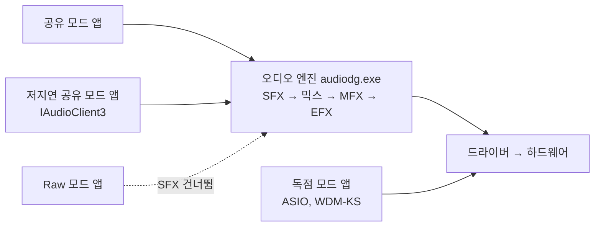
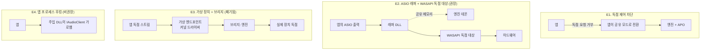
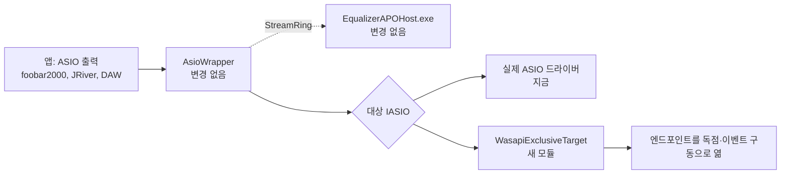

# WASAPI 독점 모드·저지연 모드 지원 조사

작성일 2026-08-30. 코드 인용은 v2.49.0 기준입니다. 실측은 메인테이너 기기(Windows 11 22621, TOPPING USB DAC, VB-CABLE, miniDSP DDRC 2x4n)와 CI 러너(Windows Server 2022, VB-CABLE Driver Pack 4.3)에서 했습니다.

이 문서는 "ASIO와 같은 방식으로, 혹은 다른 방식으로라도 WASAPI 독점 모드를 지원할 수 있는가"라는 물음에 답합니다. 저지연 공유 모드(IAudioClient3의 작은 버퍼)는 덤으로 함께 다룹니다. 결론부터 쓰면 다음과 같습니다.

- **저지연 공유 모드는 이미 지원합니다.** APO는 오디오 엔진 안에 있고, 작은 버퍼는 엔진의 주기를 줄일 뿐 엔진을 우회하지 않습니다. 설치된 DLL이 32프레임 블록까지 처리하는 것을 확인했습니다. 확인하지 못한 것은 하나(3절)이며, 그것을 CI로 못 박는 방법도 적었습니다.
- **독점 모드는 APO로는 지원할 수 없습니다.** 독점 스트림은 오디오 엔진을 거치지 않으므로 APO가 실행될 자리 자체가 없습니다. 이것은 설치 상태나 슬롯 선택과 무관한 Windows의 설계입니다.
- **독점 모드 사용자의 요구는 ASIO 래퍼를 넓혀서 채울 수 있습니다.** 독점 모드를 쓰는 응용 프로그램은 대부분 ASIO 출력도 갖고 있습니다. 지금의 래퍼는 실제 ASIO 드라이버가 있는 인터페이스만 감싸는데, 여기에 "WASAPI 독점으로 엔드포인트를 여는 대상 드라이버" 하나를 더하면 ASIO 드라이버가 없는 장치(온보드, HDMI, 드라이버 없는 USB DAC)도 `<장치 이름> (EQ APO XT)` 항목으로 열립니다. 응용 프로그램은 독점 모드에서 얻던 것(엔진의 리샘플링과 믹싱 없음, 낮은 지연, 샘플레이트 추종)을 그대로 얻고, EQ는 그 사이에서 돕니다. 새로 지을 모듈은 하나입니다(5절).
- ASIO 출력이 없는 독점 모드 응용 프로그램(스트리밍 서비스 데스크톱 앱의 '독점 모드')에는 이 계획도 닿지 않습니다. Windows의 장치 속성에서 독점 제어를 꺼 공유 모드로 돌려세우는 방법이 있지만, 이 프로젝트가 원하는 것은 독점 모드를 지원하는 것이지 막는 것이 아니므로 옵션으로도 문서로도 두지 않습니다(6절, 메인테이너 결정).

용어는 `docs/architecture/asio-host-study.md`와 같습니다. **모듈**은 인터페이스와 구현을 가진 것, **시임**은 인터페이스가 놓이는 자리, **어댑터**는 그 자리를 채우는 구현입니다.

---

## 1. 요약

| 항목 | 판정 |
|---|---|
| 저지연 공유 모드(IAudioClient3, AudioGraph 작은 버퍼) | 지원 중. APO는 엔진 안에서 작은 주기로 불릴 뿐이다. DLL은 32프레임까지 확인 |
| 저지연에서 확인하지 못한 것 | 주기가 바뀔 때 엔진이 APO를 다시 잠그는지(`LockForProcess` 재호출). 재잠금이 없으면 컨볼루션만 무음이 된다 |
| Raw 모드(`AUDCLNT_STREAMOPTIONS_RAW`) | 스트림 슬롯(SFX)은 건너뛰고 post-mix 슬롯(MFX는 Windows 10부터, EFX는 항상)은 실행된다. 두 단계를 다 설치한 기본 설치는 post-mix 단계로 계속 적용된다 |
| WASAPI 독점 모드 | APO로 불가능. 엔진을 우회한다 |
| 독점 모드 대안 | ASIO 래퍼에 WASAPI 독점 대상 드라이버를 더한다(권장). 가상 장치+브리지는 2026-08-29에 폐기된 구조라 다시 제안하지 않는다 |
| 문제 해결 | 위키 문제 해결 절에 네 종류의 스트림을 적었다. 독점 제어를 끄라는 안내는 두지 않는다(6절) |

---

## 2. 스트림 네 종류가 APO를 어떻게 지나는가

Windows의 재생 스트림은 네 갈래로 나뉘고, 그중 셋만 오디오 엔진(`audiodg.exe`)을 지납니다. APO는 그 엔진 안의 객체이므로, 엔진을 지나지 않는 스트림에는 아무것도 할 수 없습니다.

| 스트림 | 엔진을 지나는가 | 이 프로그램의 APO | 근거 |
|---|---|---|---|
| 공유 모드, 기본 주기(10 ms) | 예 | SFX(또는 LFX)와 MFX/EFX(또는 GFX) 모두 | 지금까지의 모든 동작 |
| 공유 모드, 작은 버퍼 | 예. 엔진 주기만 줄어든다 | 같음. 블록이 작아질 뿐 | Microsoft "Low Latency Audio": 앱 하나가 작은 버퍼를 요청하면 "같은 엔드포인트와 모드를 쓰는 모든 앱이 그 버퍼 크기로 옮겨 간다" |
| Raw 모드 | 예 | SFX는 로드되지 않고 MFX(Windows 10부터)와 EFX는 실행 | Microsoft "Audio Processing Object Architecture": "Windows 10 loads RAW MFX but not RAW SFX", "An endpoint effect is always applied, even to raw streams" |
| 독점 모드 | 아니오 | 없음 | Microsoft "Low Latency Audio": 독점 모드에서는 "데이터가 오디오 엔진을 우회해 응용 프로그램에서 드라이버가 읽는 버퍼로 바로 간다" |

독점 모드가 우회하는 것은 엔진 전체입니다. 슬롯을 바꾸거나(LFX/GFX, SFX/MFX, SFX/EFX), 처리 모드 목록을 늘리거나, `PKEY_Endpoint_Disable_SysFx`를 고쳐도 달라지지 않습니다. 원본 Equalizer APO의 문서와 커뮤니티가 "독점 모드에서는 동작하지 않는다"고 적어 온 이유가 이것입니다.

### 2.1 실측: 메인테이너 기기의 엔드포인트

`IAudioClient3::GetSharedModeEnginePeriod`와 `IAudioClient::GetDevicePeriod`, 독점 모드 `IsFormatSupported`를 읽기만 하는 프로브(`.gpt-out/periods/PeriodProbe.cpp`, 저장소 밖)로 활성 엔드포인트를 훑은 결과입니다. 스트림은 열지 않았습니다.

| 엔드포인트 | 믹스 형식 | 공유 기본 | 공유 최소 | 독점 최소 | 독점에서 float 믹스 형식 |
|---|---|---|---|---|---|
| TOPPING USB DAC | 48 kHz 2ch float | 480 | 480 (작은 버퍼 미선언) | 3.00 ms | 거부(16-bit PCM은 허용) |
| CABLE Input (VB-CABLE, 8ch) | 48 kHz 8ch float | 480 | 96 (2.00 ms) | 2.00 ms | 거부(16-bit PCM은 허용) |
| CABLE In 16ch | 48 kHz 16ch float | 480 | 128 (2.67 ms) | 2.00 ms | 거부 |
| Realphones System-Wide (가상) | 44.1 kHz 2ch float | 441 | 45 (1.02 ms) | 1.02 ms | 허용 |
| CABLE Output (캡처) | 48 kHz 16ch float | 480 | 480 | 3.00 ms | 거부 |

두 가지가 보입니다. 첫째, 작은 버퍼는 드라이버가 선언해야 생기며 이 기기의 USB DAC(표준 usbaudio2)는 선언하지 않습니다. 저지연 모드를 실제로 쓰는 장치는 가상 케이블과 가상 장치, 그리고 Microsoft 문서가 말하는 128프레임 지원 HDAudio 인박스 드라이버입니다. 둘째, 독점 모드는 대개 float 믹스 형식을 거부하고 정수 PCM만 받으므로, 독점으로 장치를 여는 쪽은 형식 협상을 해야 합니다(5절의 대상 드라이버가 그 일을 합니다).

### 2.2 실측: 설치된 DLL을 작은 블록으로 구동

`ApoHostProbe`(PR #321)로 설치본 `EqualizerAPO.dll`(v2.49.0 avx2)을 오디오 서비스 없이 띄워 엔드포인트 GUID로 초기화하고 블록을 밀어 넣었습니다.

| 엔드포인트 | 슬롯 | 채널 | 프레임 | Initialize / IsInputFormatSupported / LockForProcess |
|---|---|---|---|---|
| 스피커 (DDRC 2x4n) | SFX, EFX | 2 | 480, 128, 32 | 모두 S_OK |
| CABLE Input | LFX, GFX | 2, 8 | 480, 96, 32 | 모두 S_OK |

이 기기의 `config.txt`는 두 장치 블록이 전부 주석이라 이득은 0 dB였습니다(처리 자체가 아니라 잠금과 블록 처리가 성립함을 본 것입니다). 필터가 걸린 상태의 32프레임 처리는 CI의 ASIO 게이트가 매 PR마다 증명합니다. `dll-daemon-exe-pipelined-float32-32` 런은 `Tests/AsioProbe/probe-config.txt`(Preamp, PK, HS, LP, Delay, Copy)를 32프레임 블록으로 엔진 데몬에 통과시키고 엔진 직접 출력과 SHA-256이 같은지 봅니다. 엔진과 DLL 모두 작은 블록에 의존하는 가정이 없습니다.

---

## 3. 저지연 모드: 지원 중이지만 확인하지 못한 것 하나

APO의 잠금 계약은 `EqualizerAPO::LockForProcess`(`EqualizerAPO/EqualizerAPO.cpp:494-521`)에 있습니다. 연결의 `u32MaxFrameCount`를 `EngineSetup::maxFrameCount`로 넘겨 엔진을 초기화하고, 이후 `APOProcess`는 블록마다 `u32ValidFrameCount`만큼 처리합니다. IIR 필터, 프리앰프, 딜레이, Copy, VST는 블록 길이에 무관합니다.

컨볼루션은 다릅니다. `ConvolutionFilter::process`(`filters/ConvolutionFilter.cpp:82-96`)는 `hcInitSingle` 시점의 framelength를 고정 처리 길이로 쓰고, 다른 길이의 블록이 오면 무음으로 빠지며 원자 카운터에만 기록합니다(`ConvolverMuteDiagnostics::shouldMute`, `frameCount != initializedFrameCount_`). 오디오 스레드에서 재초기화(파일 I/O, FFTW plan, 할당)를 할 수 없기 때문입니다.

그래서 저지연 모드의 물음은 하나로 줄어듭니다. **앱이 작은 버퍼를 요청해 엔진 주기가 480에서 96으로 바뀔 때, 엔진이 APO를 새 `u32MaxFrameCount`로 다시 잠그는가.** 다시 잠근다면 컨볼루션은 96프레임 파티션으로 다시 만들어져 정상 동작하고(긴 IR일수록 CPU를 더 씁니다), 다시 잠그지 않는다면 컨볼루션이 든 설정만 그 앱이 도는 동안 무음이 됩니다. 나머지 필터는 어느 쪽이든 정상입니다.

이것은 로컬에서 확인하지 못했습니다. 재잠금은 `EnableTrace`의 `LockForProcess` 줄로만 보이는데 그 값은 HKLM에 있고, 이 세션에는 UAC 승인이 없습니다. CI로 못 박는 방법은 있습니다.

**검증 게이트 설계(캡처 게이트 확장).** 캡처 게이트는 이미 러너에 VB-CABLE을 설치하고 장치 선택기로 APO를 등록하며 `EnableTrace=true`로 둡니다. 여기에 라운드 하나를 더합니다.

1. `CABLE Input`(재생 쪽)에 APO를 설치한다(`DeviceSelector --install-endpoint {guid}`).
2. 게이트 설정에 `Preamp: -20 dB`와 함께 짧은 `Convolution:`(IR 파일은 게이트가 생성, 예: 단위 임펄스 하나를 담은 WAV)을 둔다.
3. `CaptureProbe`에 `--period min` 옵션을 더해 재생 쪽을 `IAudioClient3::InitializeSharedAudioStream`의 최소 주기(이 기기의 VB-CABLE은 96프레임)로 열고, `CABLE Output`에서 톤 레벨을 잰다.
4. 판정: -20 dB이면 재잠금이 있었고 컨볼루션이 새 길이로 다시 만들어진 것이다. 무음이면 재잠금이 없어 컨볼루션이 mute 분기로 빠진 것이며, 그때는 `hcInitSingle` 길이를 엔진 주기와 분리하는 수정(입력을 고정 파티션으로 모아 처리하고 그만큼 지연을 더하는 방식)이 필요하다. 어느 쪽이든 트레이스 로그의 `LockForProcess` 줄이 증거로 남는다.

CI 러너의 VB-CABLE Driver Pack 4.3이 작은 주기를 선언하는지는 러너에서 `GetSharedModeEnginePeriod`를 읽어야 압니다. 메인테이너 기기의 VB-CABLE은 96프레임을 선언했습니다. 선언하지 않는다면 이 라운드는 "작은 주기 없음"을 보고하고 건너뛰되, 그 사실을 게이트 JSON에 남깁니다.

---

## 4. 독점 모드: 가능한 형태 네 가지

APO가 닿지 못하므로 다른 자리에서 처리해야 합니다. 자리는 넷뿐입니다.

| 기준 | E1 독점 차단 | E2 래퍼 + WASAPI 대상 | E3 가상 장치 + 브리지 | E4 후킹 |
|---|---|---|---|---|
| 처리되는 스트림 | 앱이 공유 모드로 내려온 뒤의 것 | ASIO 출력을 고른 앱 | 독점 모드 앱 전부 | 주입된 앱 |
| 엔진 리샘플링·믹싱 회피 | 아니오 | 예 | 예(가상 장치 형식까지) | 예 |
| 지연 | 엔진 기본 주기 | 독점 최소 주기 + 파이프라인 버퍼 1개 | 가상 장치 주기 + 브리지 버퍼 | 0 |
| 새 바이너리 | 없음 | 래퍼 안의 대상 모듈 하나 | 커널 드라이버(attestation 서명 필수) | 주입기 + 후킹 DLL |
| 서명·오탐 | 영향 없음 | 영향 없음(기존 래퍼와 같음) | EV 인증서와 Hardware Dev Center 계정 필요. 코드 서명은 메인테이너가 보류 중 | 백신 오탐과 안티치트 충돌 |
| 선례 | Windows 소리 설정의 체크박스 | FlexASIO, ASIO2WASAPI | Voicemeeter, Realphones, VB-CABLE | 없음(게임 오버레이류) |
| 판정 | 채택하지 않음(6절) | **권장, 채택** | 2026-08-29에 폐기(연구 문서 12절). 재제안하지 않음 | 제외 |

**E3에 관해.** 독점 모드 앱 전부를 잡는 유일한 구조이지만, 시스템 사운드를 ASIO로 유도하자는 제안을 폐기할 때 같은 구조를 같은 이유(커널 드라이버, 서명, 얻는 것에 비해 무거움)로 버렸습니다. 이 문서는 그 결정을 그대로 둡니다. 메인테이너가 코드 서명을 도입하는 날 다시 볼 일이지, 지금 다시 제안할 일은 아닙니다. 사용자가 이미 VB-CABLE 같은 가상 케이블을 갖고 있다면 브리지만으로 되긴 합니다(케이블의 재생 쪽을 앱이 독점으로 열고, 호스트가 캡처 쪽을 읽어 처리한 뒤 실제 장치를 독점으로 엽니다). 그 브리지의 절반(실제 장치를 독점으로 여는 쪽)은 E2의 대상 모듈과 같은 코드라, E2를 먼저 지으면 뒤에 원할 때 붙일 수 있습니다.

**E2가 독점 모드 사용자의 요구를 채우는 이유.** 독점 모드를 고르는 이유는 세 가지입니다. 엔진의 리샘플링을 피해 원본 샘플레이트로 내보내려는 것, 다른 앱 소리와 섞이지 않으려는 것, 지연을 줄이려는 것입니다. ASIO 출력은 셋을 모두 줍니다. 독점 모드를 갖춘 재생기(foobar2000, JRiver, MusicBee, Roon, HQPlayer, Audirvana, Qobuz 데스크톱)는 ASIO 출력도 갖고 있습니다. 갖고 있지 않은 것은 스트리밍 서비스의 자체 데스크톱 앱 정도이며, 그쪽은 E1으로 공유 모드에 돌려세우면 EQ가 붙습니다. 지금의 래퍼는 실제 ASIO 드라이버가 있는 인터페이스만 대상으로 삼기 때문에(`EqualizerAPOAsio/DllMain.cpp:109-129`, 기록의 `targetClsid`를 `CoCreateInstance`), 온보드·HDMI·드라이버 없는 USB DAC에는 항목이 생기지 않습니다. E2는 그 빈자리를 채웁니다.

---

## 5. 권장 아키텍처: WASAPI 독점 대상 드라이버

### 5.1 어디에 꽂히는가

래퍼(`asio/AsioWrapper.h`)는 DAW 쪽으로 `IASIO`이고, 뒤로는 `IASIO* target`을 잡고 모든 호출을 전달합니다. 대상은 지금까지 실제 드라이버 하나뿐이었지만, 생성자가 받는 것은 `IASIO*`와 문자열 CLSID뿐이라(`AsioWrapper(IASIO* target, const GUID& wrapperClsid, const std::wstring& targetClsid, ...)`) 대상 자리는 이미 시임입니다. WASAPI 독점으로 엔드포인트를 여는 `IASIO` 구현을 두 번째 어댑터로 꽂으면 래퍼, 처리기 시임(`IStreamProcessor`), 데몬(`EngineHostCore`, `StreamRing`), 장치 문자열(`Device:` 매칭)은 한 줄도 바뀌지 않습니다.

### 5.2 새 모듈: `WasapiExclusiveTarget`

**인터페이스.** `IASIO`의 구현 하나입니다. 래퍼가 호출하는 메서드가 곧 계약입니다.

| IASIO 호출 | WASAPI로 옮기면 |
|---|---|
| `init` | 엔드포인트 GUID로 `IMMDevice` 활성화. 독점 허용 여부(`AUDCLNT_E_EXCLUSIVE_MODE_NOT_ALLOWED`)와 사용 중(`AUDCLNT_E_DEVICE_IN_USE`)은 여기서 오류 문자열로 |
| `getChannels`, `getChannelInfo` | 믹스 형식의 채널 수. 이름은 채널 마스크에서(엔진의 채널 이름 규칙과 같음) |
| `canSampleRate`, `setSampleRate` | `IsFormatSupported(EXCLUSIVE)`를 정수 컨테이너 후보(32/24-in-32/24/16비트)로 순서대로 시도. float를 받는 장치는 float |
| `getBufferSize` | `GetDevicePeriod`의 독점 최소를 최소·선호로, 기본 주기를 최대로. 정렬 실패(`AUDCLNT_E_BUFFER_SIZE_NOT_ALIGNED`)는 `GetBufferSize`의 값으로 재초기화 |
| `createBuffers` | `Initialize(EXCLUSIVE, EVENTCALLBACK, period, period, format)` + `SetEventHandle`. 버퍼는 `IAudioRenderClient`가 준 것을 두 벌로 나눠 ASIO의 이중 버퍼로 |
| `start`, `stop` | 스트리밍 스레드 시작(MMCSS Pro Audio). 이벤트마다 `bufferSwitch`를 부르고 `GetBuffer`/`ReleaseBuffer` |
| `getLatencies` | 주기 하나 + 장치 지연(`IAudioClient::GetStreamLatency`) |
| `getSamplePosition` | `IAudioClock` |
| `outputReady` | 지원. 래퍼의 조기 커밋 규칙이 그대로 통함 |
| `disposeBuffers`, `future` | 스트림 해제. `kAsioCanTimeInfo`, `kAsioCanOutputReady`만 긍정 |

**샘플 형식.** 래퍼는 이미 18종 샘플 코덱(`asio/SampleCodec.h`)으로 대상의 정수 형식과 float32 플레인을 오갑니다. 대상이 `ASIOSTInt32LSB`, `ASIOSTInt24LSB`, `ASIOSTInt16LSB`, `ASIOSTFloat32LSB` 중 장치가 받은 것을 `getChannelInfo`에 적으면 변환은 래퍼가 합니다.

**캡처.** 같은 모듈이 `eCapture` 엔드포인트도 열 수 있습니다(`IAudioCaptureClient`). 입력 방향의 엔진은 데몬이 이미 `capture=true`로 만듭니다. 첫 릴리스 범위에 넣을지는 결정 항목입니다(7절).

**프로세스 위치.** 대상은 래퍼와 함께 앱 프로세스 안에서 돕니다. 지금의 실제 드라이버도 그렇습니다. 엔진은 데몬에 있으므로 4절(연구 문서)의 프로세스 전역 상태 문제는 생기지 않습니다. 대상 자체는 COM 호출과 스레드 하나뿐입니다.

### 5.3 등록과 장치 목록

지금의 기록(`asio/WrapperRecord.h`)은 `targetClsid`와 `targetName`(HKLM\SOFTWARE\ASIO의 하위 키)을 갖고, 래퍼 CLSID는 대상 CLSID에서 파생됩니다(`AsioRegistration::wrapperClsidFor`). WASAPI 대상은 다음이 다릅니다.

- 대상 식별자는 ASIO CLSID가 아니라 엔드포인트 GUID입니다. 기록에 `targetKind`(`asio` | `wasapi-exclusive`)를 더하고, `wrapperClsidFor`는 엔드포인트 GUID에서 파생합니다. `DllGetClassObject`(`EqualizerAPOAsio/DllMain.cpp:224-249`)는 `targetKind`를 보고 `CoCreateInstance` 대신 `WasapiExclusiveTarget`을 만듭니다.
- ASIO 항목 이름은 `<엔드포인트 이름> (EQ APO XT)`입니다. 상표 규칙(제품 이름에 "ASIO" 금지)은 같습니다.
- 장치 문자열은 엔드포인트의 것을 그대로 씁니다. 스트림이 `연결이름 장치이름 {GUID}`를 내놓으면 사용자의 기존 `Device:` 블록이 그대로 맞고, `Stage:`는 지금처럼 캡처와 재생을 가릅니다. 다만 같은 엔드포인트의 APO와 이 항목이 같은 블록을 두 번 처리하지는 않습니다. 독점 스트림은 APO를 지나지 않기 때문입니다.
- 장치 선택기에서는 별도 행이 아니라 **엔드포인트 행의 문제 해결 옵션**으로 둡니다. "ASIO 응용 프로그램에 이 장치를 제공"(가칭) 체크박스 하나이며, 켜면 `AsioAPOInfo`가 하는 등록을 엔드포인트 기록으로 합니다. ASIO 행의 한 단어 표식 규칙(실제 드라이버에만)은 건드리지 않습니다. 이 배치는 결정 항목입니다(7절).
- 호스트가 게시하는 facts(`HKCU\SOFTWARE\EqualizerAPO\ASIO\{clsid}`)와 Editor 배지는 대상 종류와 무관하게 그대로 동작합니다.

### 5.4 검증 사다리

CI에는 이미 VB-CABLE이 있고(캡처 게이트), ASIO 게이트는 가짜 드라이버와 프로브로 래퍼를 검증합니다. WASAPI 대상은 가짜 드라이버 없이 실제로 잴 수 있습니다.

1. **단위:** `WasapiExclusiveTarget`의 형식 협상을 `IAudioClient` 인터페이스 뒤에 두고(시임), 가짜 클라이언트로 정렬 재시도·형식 순서·오류 매핑을 고정합니다.
2. **프로브:** `AsioProbe --target wasapi:{CABLE Input GUID} --wrapper static --processor daemon --tone`으로 래퍼가 케이블의 재생 쪽을 독점으로 열고, `CaptureProbe --capture "CABLE Output"`이 톤 레벨에서 프리앰프를 확인합니다. 설정은 `probe-config.txt`에 `Preamp:`를 더한 것입니다.
3. **실기기:** 메인테이너의 TOPPING USB DAC는 독점 최소 3 ms(144프레임)를 보고했습니다. `AsioProbe --target wasapi:{TOPPING GUID}`로 10분 게이트(ASIO 캠페인과 같은 기준: 늦은 블록 수, 왕복 분포)를 잽니다. 등록이 필요 없는 프로브 경로라 UAC 없이도 됩니다.

---

## 6. E1을 채택하지 않는 이유

Windows 소리 설정의 장치 속성(고급 탭)에 있는 "응용 프로그램에서 이 장치를 단독으로 제어할 수 있도록 허용"을 끄면 독점 요청이 `AUDCLNT_E_EXCLUSIVE_MODE_NOT_ALLOWED`로 거부되고, 응용 프로그램은 공유 모드로 내려오거나 오류를 냅니다. 그 뒤의 스트림은 엔진을 지나므로 EQ가 붙기는 합니다. 기술적으로는 값 하나입니다(엔드포인트 `Properties` 키의 `{b3f8fa53-0004-438e-9003-51a46e139bfc},3`, 없으면 허용, `,4`는 독점 앱 우선. `FxProperties`와 같은 ACL이라 장치 선택기의 레지스트리 포트로 쓸 수 있고, 소리 설정 자체는 문서화되지 않은 `IPolicyConfig::SetShareMode`를 씁니다).

메인테이너는 이것을 장치 선택기 옵션으로도, 문제 해결 문서의 안내로도 넣지 않기로 했습니다(2026-08-30). 이 프로젝트가 원하는 것은 독점 모드를 지원하는 것이지 독점 모드를 막는 것이 아니기 때문입니다. 독점 모드를 고른 사용자가 얻으려는 것(엔진 우회, 원본 샘플레이트, 낮은 지연)을 빼앗고 EQ만 남기는 방법은 지원이 아닙니다. 위키 문제 해결 절은 공유 모드로 바꾸는 것과 ASIO 항목 두 가지만 안내합니다. 위 값들은 다시 조사하지 않도록 남겨 둔 기록입니다.

---

## 7. 확인하지 못한 것과 결정 대기

**확인하지 못한 것**

- 엔진 주기 전환 시 `LockForProcess` 재호출 여부(3절). 게이트 설계는 있고, 로컬 확인은 UAC가 필요합니다.
- CI 러너의 VB-CABLE Driver Pack 4.3이 작은 주기를 선언하는지. 메인테이너 기기의 VB-CABLE은 96프레임을 선언했습니다.
- Windows 11에서 raw 모드의 MFX 로드 여부. Microsoft 문서는 Windows 10까지만 적습니다. 캡처 게이트의 raw 라운드는 VB-CABLE이 raw를 지원하지 않아 잴 수 없었습니다.

**메인테이너 결정(2026-08-30)**

1. E2를 진행한다. 첫 릴리스 범위는 재생과 캡처 모두다.
2. 장치 선택기에서는 엔드포인트 행의 옵션으로 둔다.
3. E1은 장치 선택기에도 문서에도 넣지 않는다. 독점 모드를 지원하려는 것이지 막으려는 것이 아니다(6절).
4. 3절의 저지연 검증 라운드는 독립 PR로 먼저 넣는다.

---

## 8. 구현 순서

결정에 따른 순서는 다음과 같습니다. 각 단계는 앞 단계 없이도 CI에서 초록이 됩니다.

1. **저지연 검증 라운드**(3절, 독립 PR): `CaptureProbe --period min`, 게이트의 `CABLE Input` 재생 라운드, 컨볼루션 판정. 결과에 따라 컨볼루션 파티션 분리 여부를 정합니다.
2. **`WasapiExclusiveTarget`**(재생과 캡처): `asio/WasapiExclusiveTarget.{h,cpp}`, `IAudioClient` 시임의 가짜 클라이언트 단위 테스트, `AsioProbe --target wasapi:{guid}`.
3. **기록과 등록**: `WrapperRecord::targetKind`, `DllGetClassObject` 분기, `AsioRegistration`의 엔드포인트 파생 CLSID, ASIO 게이트에 VB-CABLE 라운드.
4. **장치 선택기**: 엔드포인트 행의 옵션, `DeviceInstallReport`, 다섯 스킨 샷, 번역 5언어.
5. **문서**: `docs/features/asio.md`에 WASAPI 대상 절, 위키 문제 해결 절 갱신, README/CHANGELOG 4파일.

참고한 외부 문서: Microsoft Learn "Low Latency Audio", "Audio Processing Object Architecture", "AUDCLNT_STREAMOPTIONS"; dechamps/APO 노트; FlexASIO와 ASIO2WASAPI(WASAPI 독점을 ASIO로 내놓는 선례); Microsoft Community Hub "Disable Exclusive Mode for All Audio Devices via PS"(레지스트리 값).
