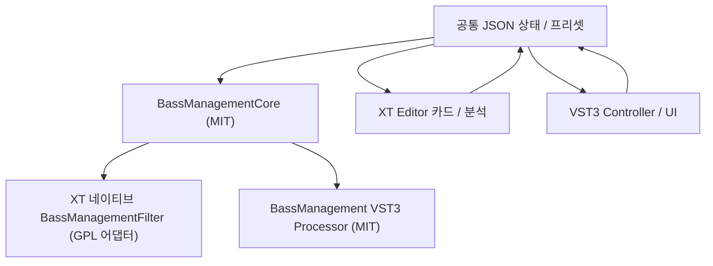

# Issue #246 Bass Management 구현 계획

> **명칭 변경 안내.** 이 계획서의 'Bass Management'는 구현 후 심사에서
> **Subwoofer Routing**으로 이름이 바뀌었다. 커맨드는 `SubwooferRouting:`,
> 프로필 확장자는 `.swxt.json`, 스키마 id는
> `equalizerapo.xt.subwoofer-routing`, VST3 플러그인은
> `EAPO XT Subwoofer Routing`(`EapoXtSubwooferRouting.vst3`)이다. 이 문서는
> 작성 당시 이름 그대로 보존한다.

- 이슈: [#246 너무 복잡한 서브우퍼 라우팅 문제](https://github.com/115dkk/EqualizerAPO-XT/issues/246)
- 마지막 대조: 2026-07-31
- 상태: 구현 전 계획
- 전달 대상: 다음 구현 턴의 낮은 effort 모델

이 문서는 이슈 #246과 현재 코드 베이스를 읽고 만든 구현 지시서다. 대화의 요약이나
후속 추측보다 이 문서를 우선한다. 항목은 선택지가 아니라 완료 조건이다.

한 번의 구현 턴에서 다음 결과를 모두 낸다.

1. 공유 Bass Management 상태 모델과 실시간 DSP 코어
2. EqualizerAPO-XT 네이티브 `BassManagement:` 필터
3. MIT 라이선스 VST3 플러그인
4. XT Editor 전용 카드와 전체 편집기
5. Minimal, Matrix, Rack, Soft, Studio의 서로 다른 카드 표현
6. 빌드, 패키징, 문서, 필요한 회귀 테스트

VST3만 완성하거나, 네이티브 필터만 완성하거나, 다섯 스킨 중 일부만 만든 상태는 완료가
아니다. 내부 작업 순서는 나눌 수 있지만 별도 후속 기능이나 별도 PR로 미루지 않는다.

## 1. 문제와 제품 동작

이슈의 목적은 단순한 서브우퍼 크로스오버가 아니다. 다음 기능을 하나의 의미 있는
Bass Management 모델로 묶는 것이다.

- 메인 스피커의 저역을 버리지 않고 별도 bass path로 분기
- 전·후방처럼 서로 다른 스피커 그룹마다 다른 HPF, LPF, EQ와 지연 사용
- 물리 `LFE` 입력을 처리 전에 보존하고 기본 `+10 dB`를 포함한 독립 처리를 제공
- 처리된 main/bass/source-LFE 경로를 물리 출력으로 다시 합산
- 경로마다 gain, delay, polarity와 parametric EQ 적용
- 합산에 필요한 headroom을 계산하고 자동 또는 수동 trim 제공
- 복잡한 `Copy`/`Channel`/`Filter`/`Include` 묶음 대신 카드 한 장에서 의미를 편집
- 같은 상태와 DSP를 XT 네이티브 필터와 VST3에서 사용

네이티브 필터는 VST3를 XT 안에서 자동 로드하는 래퍼가 아니다. 엔진이
`BassManagement:` 명령을 직접 파싱하고 `IFilter` 구현을 실행해야 한다. VST3가
설치되지 않은 환경에서도 네이티브 기능 전체가 동작해야 한다.

VST3는 APO 밖의 DAW나 다른 호스트에서도 같은 기능을 쓰기 위한 배포 형태다. 네이티브와
VST3는 중복 제품이 아니라 같은 코어의 서로 다른 정식 어댑터다.

## 2. 현재 코드에서 확인한 전제

### 2.1 `Copy`가 원본 LFE를 잃는 엔진 결함은 없다

`CopyFilter::initialize()`가 대상 채널만 반환하더라도 `FilterEngine`은
`allChannelNames`를 계속 보존하고 필터가 쓰는 출력 슬롯만 교체한다. 매칭되지 않은
채널은 엔진 전체 채널 집합에서 사라지지 않는다.

따라서 `RAWLFE` 같은 가상 채널을 엔진 결함 우회용으로 추가하지 않는다. Bass Management
코어가 처리 시작 시 물리 LFE 입력을 별도 source path로 읽고, 최종 출력 행렬이 그
source path를 참조하면 된다.

관련 코드:

- `engine/IFilter.h`
- `engine/FilterEngine.Runtime.cpp`
- `filters/CopyFilter.cpp`

### 2.2 네이티브 필터의 기존 연결 경로

새 네이티브 명령은 다음 등록 경로를 모두 지나야 한다.

1. `FilterFactoryRegistry`의 명령/우선순위
2. `BassManagementCommand` 파서
3. `BassManagementFilterFactory`
4. `BassManagementFilter : IFilter`
5. `FilterGUIFactoryRegistry`의 템플릿과 legacy 진입점
6. `FilterCardEditorRegistry`의 현대 카드
7. `FilterCardModel`의 타입, 배지, 제목, 요약, 아이콘
8. `Common.vcxproj`, `Editor/Editor.pro`, 테스트 프로젝트의 소스 목록

정적 등록 매크로가 명령 목록의 단일 진실 공급원이다. 별도 중앙 명령 문자열 목록을 만들지
않는다.

### 2.3 VST3 호스트의 4.1 배치 결함을 먼저 고쳐야 한다

현재 호스트는 채널 수가 5이면 `k50`만 선택한다. 이슈의 실제 채널은
`L/R/LFE/RL/RR`이며 VST3 의미상 `k41Music`이다. 채널 수만으로 배치를 정하면 4.1을
5.0으로 잘못 광고하고 LFE와 rear 채널의 의미가 바뀐다.

호스트는 이름/스피커 마스크를 기준으로 배치를 선택하고, EAPO 메모리 순서와 VST3 bus
순서가 다르면 명시적으로 gather/scatter해야 한다.

### 2.4 다섯 스킨은 색상표가 아니라 생성 구조가 다르다

`ISkin`과 `SkinManager`는 이미 다음 구조적 팩토리를 제공한다.

- 스킨별 filter picker
- 스킨별 reference card
- 스킨별 Copy routing renderer
- 스킨별 QPainter 기반 graph, knob, segmented control, card chrome

라우팅 렌더러는 다음처럼 실제 UI 문법이 다르다.

| 스킨 | 기존 라우팅 표현 |
| --- | --- |
| Minimal | `StepListRoutingRenderer` |
| Matrix | `CrosspointMatrixRoutingRenderer` |
| Rack | `HardwarePatchbayRoutingRenderer` |
| Soft | `BlockChipRoutingRenderer` |
| Studio | `LightTraceRoutingRenderer` |

Bass Management도 같은 패턴을 따른다. 공통 상태를 한 카드에 넣고 QSS 색만 바꾸는 방식은
완료로 인정하지 않는다.

### 2.5 프로필 파일은 config 디렉터리에서 자동 재로딩할 수 있다

`ConfigWatcher`는 config 디렉터리를 재귀 감시한다. 기본 Bass Management 프로필을 config
아래에 저장하고 `QSaveFile`로 교체하면 기존 설정 재로딩 경로를 그대로 사용할 수 있다.

외부 프로필을 고르면 기존 `FileReferenceController`와 같은 흐름으로 오디오 서비스의
읽기 권한을 검사하고 config 디렉터리로 가져오는 동작을 제공한다.

## 3. 이슈 #246 기준 프리셋

일반화된 UI와 별개로 제보자의 원본 동작을 재현하는 내장 프리셋을 둔다. 이름은
`Issue #246 — Front/Rear 4.1`로 한다.

입력/출력 채널:

```text
L R LFE RL RR
```

처리 경로:

| 경로 | 입력 mix | 필터/처리 | 지연 |
| --- | --- | --- | --- |
| Front L main | `+1.0 L` | HPQ 80 Hz, Q 0.707; FL EQ | 2.5 ms |
| Front R main | `+1.0 R` | HPQ 80 Hz, Q 0.707; FR EQ | 2.5 ms |
| Front bass | `-1.0 L -1.0 R` | LPQ 80 Hz, Q 0.707 두 단; FLFE EQ | 0 ms |
| Rear L main | `+1.0 RL` | HPQ 100 Hz, Q 0.707; RL EQ | 2.0 ms |
| Rear R main | `+1.0 RR` | HPQ 100 Hz, Q 0.707; RR EQ | 2.0 ms |
| Rear bass | `-1.0 RL -1.0 RR` | LPQ 60 Hz, Q 0.707; RLFE EQ | 0 ms |
| Source LFE | `+1.0 LFE` | LFE EQ; pre-gain `+10 dB` | 0 ms |

최종 출력 행렬:

| Source path | L | R | LFE | RL | RR |
| --- | ---: | ---: | ---: | ---: | ---: |
| Front L main | 0 dB |  |  |  |  |
| Front R main |  | 0 dB |  |  |  |
| Front bass | 0 dB | 0 dB | -14 dB |  |  |
| Rear L main |  |  |  | 0 dB |  |
| Rear R main |  |  |  |  | 0 dB |
| Rear bass |  |  | 0 dB |  |  |
| Source LFE | 0 dB | 0 dB | -14 dB |  |  |

원본의 `FL.txt`, `FR.txt`, `RL.txt`, `RR.txt`, `FLFE.txt`, `RLFE.txt`,
`LFE.txt`는 프리셋에 빈 EQ slot으로 나타내고, 각 slot에서 Equalizer APO
`Filter:` 행을 가져올 수 있게 한다. VST3가 외부 APO `Include:`를 실행하게 만들지 않는다.
가져온 필터는 공통 상태의 biquad 목록으로 변환한다.

프리셋 검증은 원본 가상 채널 사슬과 새 코어를 동일 입력으로 실행해 출력
`L/R/LFE/RL/RR`을 비교한다.

## 4. 목표 아키텍처



### 4.1 라이선스 경계

`BassManagementCore`와 VST3 프로젝트는 MIT로 둔다. 코어는 다음 항목에 의존하지 않는다.

- Qt
- `Common.vcxproj`
- GPL 필터/엔진 클래스
- Equalizer APO 레지스트리/서비스 코드
- VST3 인터페이스

네이티브 어댑터는 GPL인 현재 저장소에서 MIT 코어를 링크한다. 반대 방향 링크는 금지한다.

VST3 프로젝트는 MIT 코어와 핀 고정된 MIT/BSD 호환 의존성만 링크한다. SDK 및 JSON
라이선스 파일을 플러그인 배포물에 포함한다.

### 4.2 프로젝트 배치

```text
BassManagementCore/
  include/BassManagement/...
  src/...
  BassManagementCore.vcxproj

filters/bassManagement/
  BassManagementCommand.*
  BassManagementFilterFactory.*
  BassManagementFilter.*

Editor/widgets/bassmanagement/
  BassManagementEditorDialog.*
  BassManagementUiModel.*
  BassManagementResponseView.*

Editor/widgets/cards/
  BassManagementCardEditor.*
  BassManagementCardView.*

Editor/widgets/routing/
  BassManagementRoutingAdapter.*

Editor/skins/cards/
  MinimalBassManagementCardView.*
  MatrixBassManagementCardView.*
  RackBassManagementCardView.*
  SoftBassManagementCardView.*
  StudioBassManagementCardView.*

VST3/BassManagement/
  processor.*
  controller.*
  editor.*
  factory.*
  resources/...
```

필요한 빌드 프로젝트는 `EqualizerAPO.sln`에 추가한다. 기존
`$(VST3_SDK)`/`deps/vst3sdk` 관례를 사용하고 사용자 소유의 untracked SDK 폴더를 전제로
하지 않는다. CI가 플러그인 빌드에 더 많은 SDK 소스를 필요로 하면 버전과 경로를 고정해
다운로드한다.

## 5. 공통 상태 모델

### 5.1 저장 형식

네이티브 명령은 두 형식을 지원한다.

```text
BassManagement: State {"schema":"equalizerapo.xt.bass-management","version":1,...}
BassManagement: Profile "BassManagement\Living Room.bmxt.json"
```

- `State`는 압축하지 않은 compact JSON이다.
- `Profile`은 같은 JSON을 담은 UTF-8 `*.bmxt.json` 파일이다.
- 새 필터 템플릿은 유효한 기본 `State`를 즉시 삽입한다.
- VST3 `getState`/`setState`는 같은 JSON 바이트를 사용한다.
- 네이티브와 VST3 사이에서 state/profile import와 export가 가능해야 한다.
- parser, validator, migration, canonical serializer는 코어의 한 구현만 사용한다.

`BassManagementCommand`는 `State`와 `Profile` 태그 및 payload/path만 파싱한다. JSON
의미 해석은 `BassManagementStateCodec`가 담당한다.

### 5.2 논리 모델

상태는 물리 채널을 직접 수정하는 명령 목록이 아니라 이름이 있는 처리 그래프다.

```text
physical inputs
  -> source mixes
  -> named main/bass/source-LFE paths
  -> path-local filter/delay/polarity/gain
  -> output matrix
  -> physical outputs
```

필수 엔터티:

- `layout`
  - 예상 physical channel ID와 표시 이름
  - `LFE`/`SUB`, side/rear 별칭을 adapter에서 canonical ID로 변환
- `speakerGroups[]`
  - 안정적인 `id`, 사용자 표시 이름
  - 한 개 이상의 main path
  - 선택적인 bass path
- `paths[]`
  - 안정적인 `id`
  - `kind`: `main`, `bass`, `sourceLfe`
  - physical input의 가중합인 `sourceMix[]`
  - pre/post gain
  - polarity
  - delay
  - ordered filter chain
- `outputMatrix[]`
  - target physical output
  - `replace` 또는 `add` 모드
  - source path와 gain의 합
- `headroom`
  - `auto` 또는 `manual`
  - manual trim과 계산 결과
- `metadata`
  - preset/profile 이름
  - 생성/수정 애플리케이션 버전

경로와 행렬은 사용자 표시 이름이 아니라 안정적인 ID를 참조한다. 이름을 바꿔도 연결이
깨지지 않아야 한다.

### 5.3 필터 체인

각 path는 다음 처리를 순서대로 가질 수 있다.

- gain
- polarity inversion
- integer/fractional delay
- HPF/LPF section
- peaking, low-shelf, high-shelf, notch, all-pass biquad
- 여러 section을 이용한 BW2, LR4 등의 crossover

Editor는 필터 종류를 고수준 crossover와 EQ로 나눠 보여주지만 코어에는 한 ordered filter
chain으로 컴파일한다. 이슈 프리셋처럼 main HPF와 bass LPF의 차수가 다른 구성도 보존한다.

### 5.4 검증과 migration

상태를 오디오 그래프로 컴파일하기 전에 다음을 검증한다.

- schema와 version
- 중복 path/group ID
- 존재하지 않는 path 또는 output 참조
- 유한하지 않은 gain, delay, frequency, Q
- sample rate에서 유효하지 않은 cutoff
- 출력이 없는 matrix와 입력이 없는 path
- graph cycle
- 현재 장치에 없는 physical channel

지원되는 이전 version은 명시적 migration 후 canonical version으로 직렬화한다. 더 최신인
version은 조용히 일부 필드만 읽지 말고 구체적인 오류를 낸다. 엔진은 해당 필터를
pass-through하고 나머지 설정을 계속 실행한다.

## 6. 공통 DSP 코어

### 6.1 API

코어는 UI 상태를 immutable `ProcessingGraph`로 컴파일하고 float/double processor를
제공한다.

```cpp
ValidationResult validate(const BassManagementState&);
CompileResult compile(const BassManagementState&, const PrepareSpec&);

class Processor {
public:
    void prepare(const PrepareSpec&, const ProcessingGraph&);
    void reset();
    void process(const AudioBlock&);
};
```

`PrepareSpec`에는 sample rate, 최대 block size, canonical channel layout이 들어간다.
네이티브와 VST3 adapter가 자기 채널 표기를 canonical channel ID로 바꿔 전달한다.

### 6.2 처리 순서

한 block은 다음 순서로 처리한다.

1. 모든 physical input을 읽기 전용으로 유지
2. source mix를 path scratch에 생성
3. path별 gain/polarity/filter/delay 실행
4. output matrix로 target별 합산
5. auto/manual headroom trim 적용
6. matrix가 건드리지 않은 채널을 원본에서 그대로 복사

최종 행렬이 `LFE` 출력을 교체하더라도 source-LFE path는 1단계의 원본 입력을 읽는다.

### 6.3 실시간 조건

`prepare()`에서 다음을 전부 완료한다.

- channel/path index 해석
- biquad coefficient 계산
- delay buffer와 scratch 할당
- sparse matrix plan 생성
- headroom trim 계산

`process()`에서는 다음을 하지 않는다.

- heap allocation/deallocation
- mutex/condition variable
- 파일/레지스트리 접근
- 로그 출력
- Qt 또는 COM 호출
- coefficient 재계산

설정 변경은 네이티브에서는 기존 `FilterConfiguration` 재생성과 crossfade를 사용하고,
VST3에서는 control thread가 새 graph를 준비한 뒤 lock-free generation swap으로
넘긴다. 오디오 스레드가 UI state나 JSON을 읽지 않는다.

### 6.4 Headroom

auto headroom은 단순히 연결 개수에 `-6 dB`를 곱하지 않는다. 컴파일 시 각 출력에 대해
다음을 계산한다.

- output matrix의 coherent gain 합
- crossover/PEQ의 주파수 응답
- source mix 계수

20 Hz부터 Nyquist까지 로그 간격으로 응답을 샘플링하고 예상 peak가 0 dBFS를 넘지 않게
공통 trim을 정한다. UI에는 계산된 trim과 가장 위험한 출력/주파수를 표시한다. 사용자는
manual trim으로 바꿀 수 있다.

## 7. XT 네이티브 필터

### 7.1 명령과 factory

추가 파일:

- `filters/bassManagement/BassManagementCommand.h/.cpp`
- `filters/bassManagement/BassManagementFilterFactory.h/.cpp`
- `filters/bassManagement/BassManagementFilter.h/.cpp`

`FilterFactoryPriority`에 `BassManagement`를 processing filter 구간에 추가하고 뒤 번호를
연속적으로 이동한다.

```cpp
REGISTER_FILTER_FACTORY(
    FilterFactoryPriority::BassManagement,
    BassManagementFilterFactory,
    L"BassManagement")
```

factory 처리:

1. 명령이 다르면 빈 vector로 통과
2. `State`면 JSON payload parse/validate
3. `Profile`이면 config 파일 기준으로 경로를 해석하고 JSON load/validate
4. 실패하면 `reportParseError()`로 실제 원인을 보고
5. 성공하면 immutable state를 소유한 `BassManagementFilter` 한 개 생성

경로의 quote, 환경 변수, 상대 경로는 기존 convolution/reference 경로와 같은 규칙을
사용한다.

### 7.2 `IFilter` 계약

```cpp
bool getAllChannels() override { return true; }
bool getInPlace() override { return false; }
bool getSelectChannels() override { return false; }
bool producesTailFromSilentInput() const override { return true; }
```

`initialize()`:

- 전체 채널 이름을 canonical ID와 core slot으로 매핑
- 코어 graph와 double processor 준비
- 전달받은 채널 이름 vector를 같은 순서로 반환

`process()`:

- 모든 output buffer를 채움
- 상태가 참여시키지 않은 물리/가상 채널은 bit-exact copy
- core double processor 호출

`getAllChannels()`를 사용하므로 앞의 `Channel:` 선택에 의해 레이아웃 일부만 보이는
필터가 되어서는 안 된다. Editor 카드도 enclosing Channel scope badge를 표시하지 않는다.

### 7.3 프로필 재로딩

Editor가 config 아래 `*.bmxt.json`을 `QSaveFile`로 교체하면 기존 recursive
`ConfigWatcher`가 configuration을 다시 만든다. 새 filter/graph는 notification thread에서
완성되고 현재 엔진의 transition 경로로 교체된다.

## 8. VST3 호스트 수정

플러그인을 검증하기 전에 기존 호스트의 layout 협상을 고친다.

### 8.1 arrangement 선택

채널 수가 아니라 의미 있는 채널 집합으로 결정한다.

| EAPO 채널 | VST3 arrangement |
| --- | --- |
| `L R` | `kStereo` |
| `L R C RL RR` | `k50` |
| `L R LFE RL RR` | `k41Music` |
| `L R C LFE RL RR` | `k51` |
| `L R C LFE RL RR SL SR` | `k71Cine` 또는 현재 host의 일관된 7.1 정의 |

각 arrangement마다 EAPO slot ↔ VST speaker bit/bus slot 표를 하나의 함수에서 만든다.
특히 `k41Music`의 bus 순서와 EAPO의 `L/R/LFE/RL/RR` 순서가 같다고 가정하지 않는다.

### 8.2 bus 정책

Bass Management VST3는 하나의 symmetric main input/output bus를 제공한다. 현재 호스트도
첫 main bus만 활성화하므로 aux/sidechain으로 우회하지 않는다.

factory subcategory는 `Fx|Tools`다. `Spatial`, `Surround`, `Up-Downmix`로 등록하면 현재
호스트가 입력을 stereo로 좁혀 upmixer로 취급할 수 있으므로 사용하지 않는다.

### 8.3 host 회귀 테스트

`Tests/HybridConvTests/Vst3HostTests.cpp`와 `TestVst3Plugin`에 다음을 추가한다.

- 5.0과 4.1이 서로 다른 arrangement로 전달됨
- `L/R/LFE/RL/RR` impulse가 plugin bus의 올바른 speaker slot에 도착
- plugin 출력이 다시 올바른 EAPO 물리 채널로 돌아옴
- 4.1에서 LFE가 center 또는 rear slot으로 바뀌지 않음

## 9. VST3 플러그인

### 9.1 Processor

- 공통 JSON state를 parse/serialize
- host가 합의한 speaker arrangement를 canonical channel ID로 변환
- float32와 float64 process 지원
- 공통 `ProcessingGraph`와 processor 사용
- 하나의 main bus, no aux bus
- silence flag와 tail을 올바르게 처리
- block size 변경은 `setupProcessing`/`setActive` 경계에서 prepare

### 9.2 Controller와 UI

VST3 UI는 XT Qt widget을 링크하지 않는다. 그러나 다음 semantic control은 네이티브
Editor와 동일해야 한다.

- layout/preset
- source LFE preserve, gain, low-pass, EQ, delay, polarity
- speaker groups와 main HPF
- bass path LPF와 EQ
- 두 라우팅 행렬
- output gain
- auto/manual headroom
- audition/measurement
- state/profile import/export

UI 조작은 state command 또는 완성된 state snapshot으로 processor에 전달한다. knob drag마다
JSON 전체를 오디오 스레드로 보내지 않는다.

### 9.3 번들

표준 `.vst3` bundle 구조와 architecture별 binary를 만든다. 플러그인 식별자와 class ID는
테스트 plugin과 겹치지 않는 고정 값을 사용한다. MIT `LICENSE`, third-party notices,
factory metadata를 포함한다.

## 10. XT Editor 통합

### 10.1 GUI factory와 filter picker

추가 파일:

- `Editor/guis/BassManagementFilterGUIFactory.h/.cpp`

factory는 `BassManagement:` 명령을 claim한다. 빈 parameter도 claim해야 새 필터를 삽입했을
때 body 없는 행으로 떨어지지 않는다.

`createFilterTemplates()`는 `Speaker management` 카테고리에 완성된 기본 `State`를 넣는다.
선택 장치 레이아웃을 알 수 있으면 그 채널로 기본 상태를 만들고, 알 수 없으면 안전한
stereo 상태를 만든 뒤 카드에서 채널을 선택하게 한다.

### 10.2 카드 등록과 descriptor

추가 파일:

- `Editor/widgets/cards/BassManagementCardEditor.h/.cpp`
- `Editor/widgets/cards/BassManagementCardView.h/.cpp`

등록:

```cpp
REGISTER_FILTER_CARD_EDITOR(BassManagement, ...)
```

`FilterCardModel`에는 다음 descriptor를 추가한다.

- type: `bassmanagement`
- badge: `BASS`
- title: `Bass Management`
- 독립된 type color
- inline state면 layout/group/bus/headroom 요약
- profile이면 파일명과 load 상태 요약

`Editor/icons/modern/bass-management.svg`, `Editor.qrc`,
`FilterCardModel::commandIconResource()`를 함께 갱신한다.

### 10.3 카드 상태

`BassManagementCardState`는 최소 다음 값을 뷰에 전달한다.

- enabled/valid
- layout label
- source LFE preserve/gain
- speaker group 수
- bass path 수
- 대표 HPF/LPF
- output matrix의 활성 edge
- auto/manual headroom과 계산 trim
- inline/profile 이름과 dirty/linked 상태
- warning/error
- audition target

카드의 공통 동작:

- Open editor
- Preset
- Save as profile
- Link/import profile
- Edit this row
- Update linked profile
- Audition/measurement

행 header의 enable toggle을 body에서 중복 구현하지 않는다.

### 10.4 전체 편집기

추가 파일:

- `Editor/widgets/bassmanagement/BassManagementEditorDialog.h/.cpp`
- `Editor/widgets/bassmanagement/BassManagementUiModel.h/.cpp`
- `Editor/widgets/bassmanagement/BassManagementResponseView.h/.cpp`

편집 영역:

1. **Layout & preset**
2. **Source LFE**
3. **Speaker groups**
4. **Bass paths and EQ**
5. **Output matrix**
6. **Response & headroom**
7. **Audition/measurement**

`Apply` 전에는 in-memory copy를 편집한다. `Cancel`은 config 행과 profile 파일 모두 그대로
둔다.

- inline state의 Apply: 행의 canonical compact JSON을 교체하고 `updateModel()`
- linked profile의 Apply:
  - `Edit this row` 선택 시 inline state로 전환
  - `Update linked profile` 선택 시 명시적으로 `QSaveFile` 원자 갱신

외부 파일을 조용히 수정하지 않는다. profile link 상태와 적용 대상을 UI에 항상 표시한다.

### 10.5 두 라우팅 행렬 재사용

추가 파일:

- `Editor/widgets/routing/BassManagementRoutingAdapter.h/.cpp`

기존 `IRoutingRenderer`를 다음 두 모델에 재사용한다.

1. speaker group/source-LFE → bass path send
2. processed main/bass/source-LFE path → physical output

`BassManagementRoutingAdapter`가 core route와 `std::vector<Assignment>`를 왕복한다.
`RoutingPortModel.fixedSources`로 source 목록을 고정하고 factor 편집은 dB를 지원한다.
라우팅 view에서 사용하는 문자열은 stable path ID이고, 화면에는 별도 표시 이름을 쓴다.

Minimal/Matrix/Rack/Soft/Studio는 각각 기존 step list/crosspoint/patchbay/chip/light-trace
문법으로 같은 matrix를 보여준다. Copy 문법으로 state를 직렬화하지는 않는다.

### 10.6 Response와 measurement

response view는 core의 compiled graph를 frequency-domain으로 샘플링한다. 각 스킨의
기존 graph paint hook을 사용해 현재 스킨 문법으로 그린다.

audition/measurement는 profile의 영구 설정과 분리된 session override다.

- main path solo
- bass path solo
- source LFE solo
- 선택 output만 활성
- polarity/phase 확인

Editor가 임시 상태를 config에 적용해야 한다면 RAII guard로 원래 state를 보관하고 dialog
close/destructor에서 복원한다. 비정상 종료 후 특정 speaker만 solo로 남지 않도록 임시
override에는 만료 시간을 두고 native processor가 만료 뒤 normal graph로 돌아간다.

## 11. 다섯 스킨 카드

### 11.1 스킨 계약

`ISkin`과 `SkinManager`에 다음 팩토리를 추가한다.

```cpp
virtual BassManagementCardView*
createBassManagementCardView(QWidget* parent) const;
```

`BassManagementCardEditor`는 active skin에서 view를 만들고 공통 `BassManagementCardState`로
구동한다. 스킨별 view는 state 파일을 직접 읽거나 명령을 직렬화하지 않는다.

### 11.2 스킨별 구조

| 스킨 | 카드 구조 | 반드시 보여줄 상태 |
| --- | --- | --- |
| Minimal | 모노스페이스 상태 행과 `MAIN -> BASS -> OUT` 단계 목록 | HP/LP, LFE gain, trim을 정렬된 숫자로 |
| Matrix | group/path × output의 미니 crosspoint 보드 | 활성 셀, dB factor, coordinate형 warning |
| Rack | crossover module faceplate와 bus meter | HP/LP selector, LFE lamp, headroom meter |
| Soft | rounded group/bass chip과 짧은 흐름선 | 그룹 묶음, destination, warning chip |
| Studio | main/bass signal trace와 dual response | 대역별 trace, source LFE, 발광 headroom |

추가 파일:

- `Editor/skins/cards/MinimalBassManagementCardView.h/.cpp`
- `Editor/skins/cards/MatrixBassManagementCardView.h/.cpp`
- `Editor/skins/cards/RackBassManagementCardView.h/.cpp`
- `Editor/skins/cards/SoftBassManagementCardView.h/.cpp`
- `Editor/skins/cards/StudioBassManagementCardView.h/.cpp`

### 11.3 UI 품질 조건

- 실제 action은 `QToolButton` 등 접근 가능한 widget으로 만들고 그림 속 가짜 버튼을 만들지
  않는다.
- 같은 keyboard navigation, accessible name, tooltip, error text를 제공한다.
- 포인터 target은 최소 약 40 px를 유지한다.
- 수치는 tabular/monospace로 배치해 값 변화 때 폭이 흔들리지 않게 한다.
- QPainter 선과 1 px border는 device pixel ratio에서 흐려지지 않게 맞춘다.
- 좁은 카드에서는 부차 정보가 접히되 핵심 상태와 편집 진입점은 사라지지 않는다.
- construction-time 구조가 필요한 view는 skin switch 때 재생성한다.
- 열린 전체 편집기는 `skinChanged`를 받아 routing view와 response를 같은 in-memory model로
  재생성한다.
- dark/light 모두 tokens를 사용하고 피부별 raw color 복사본을 공통 widget에 넣지 않는다.

## 12. 프로필, 가져오기, 문서와 패키징

### 12.1 파일 의존성

`Editor/import/ConfigDependencyScanner.cpp`가 `BassManagement: Profile`을 reference
command로 인식하게 한다.

- import manifest에 `*.bmxt.json` 포함
- source tree 안의 상대 경로 유지
- config directory로 복사한 뒤 행의 상대 경로 갱신
- audio service read access 검사
- missing profile을 카드와 line parse trace 양쪽에 표시

프로필 JSON 안의 EQ는 자체 포함한다. 임의의 APO `Include:` 파일을 profile loader가
재귀 실행하지 않는다. Editor의 명시적 `Filter:` import가 공통 biquad state로 변환한다.

### 12.2 문서

다음 문서를 같은 변경에서 갱신한다.

- configuration reference의 `BassManagement:` 문법
- native State/Profile 예제
- #246 preset 설명
- VST3 설치와 bundle 위치
- native와 VST3 사이 preset 이동
- source LFE와 output LFE의 차이
- auto headroom의 의미

### 12.3 설치

- 네이티브 filter/core는 기존 Equalizer APO binary 구성에 포함
- VST3 bundle은 설치 선택 항목이지만 같은 release artifact에서 제공
- 기본 `*.bmxt.json` 프리셋과 라이선스 설치
- uninstall/upgrade 때 사용자 profile은 삭제하거나 덮어쓰지 않음

## 13. 구현 순서

다음 순서를 그대로 사용한다. 번호는 검증 경계일 뿐 작업 종료 지점이 아니다.

1. 작업 트리와 사용자 소유 변경을 확인하고 관련 파일만 편집
2. 4.1 VST3 arrangement 실패 테스트를 추가하고 host 수정
3. 공통 state/codec/validation/migration 구현
4. #246 preset과 processing graph compiler 구현
5. core DSP와 focused unit test 구현
6. XT native command/factory/filter 연결
7. native parser/engine/config reload 통합 테스트
8. Editor GUI factory, descriptor, 기본 카드, profile 흐름 구현
9. 두 routing adapter와 전체 편집기 구현
10. 다섯 스킨 전용 card view 구현
11. VST3 processor/controller/editor 구현
12. native/VST output parity 검증
13. SkinGallery, packaging, docs, CI/source-list lint 갱신
14. 전체 관련 테스트와 Release build 실행

5번 코어, 6번 네이티브, 10번 다섯 스킨, 11번 VST3 중 하나라도 남아 있으면 완료로
보고하지 않는다.

## 14. 검증 계획

### 14.1 Core DSP

필수 사례:

- #246 4.1 preset의 원본 가상 채널 사슬 대비 출력
- LFE-only impulse가 source-LFE path를 거쳐 지정 출력에 도착
- main-only 저역이 main HPF와 bass LPF로 분기
- main 고역이 bass path에서 충분히 감쇠
- front/rear의 서로 다른 crossover와 delay
- polarity inversion의 부호
- 복수 source가 한 output에 합산될 때 gain
- auto headroom과 manual override 한 사례
- 상태에 없는 물리/가상 채널의 bit-exact pass-through
- block을 나눠도 IIR/delay 결과가 연속

### 14.2 State와 profile

- `State -> parse -> canonical serialize -> parse`
- `Profile -> load -> canonical serialize`
- Unicode profile/display name
- 상대/절대/quoted path
- 잘못된 JSON과 missing file
- 중복 ID, dangling route, newer schema version
- `QSaveFile` 교체 후 config reload

### 14.3 Native/VST parity

동일한 canonical state와 입력으로 다음을 비교한다.

- core double ↔ native double: sample-equivalent
- core double ↔ VST3 double: sample-equivalent
- core float ↔ VST3 float: 수치 허용 오차
- reset/activate 뒤 state가 남지 않음
- 4.1 channel gather/scatter

### 14.4 Editor

`EditorLogicTests`에서 다음을 고정한다.

- engine canonical command가 `BassManagement`를 인식
- GUI factory가 빈 행과 유효 State/Profile을 claim
- card registry가 올바른 editor 생성
- descriptor, badge, icon, summary
- inline/profile store round trip
- routing adapter의 두 matrix 왕복
- skin switch 때 모델 상태 유지

### 14.5 시각 QA

`Editor/SkinGallery.cpp`에 다음 fixture를 추가한다.

- 정상 #246 preset 카드
- missing/invalid profile 경고 카드
- measurement/solo 상태 카드
- 펼친 전체 편집기의 두 routing matrix

5 skins × light/dark에서 렌더하고 다음을 눈으로/구조 probe로 확인한다.

- 다섯 카드의 구조가 실제로 다름
- 잘린 수치, 겹친 control, clipped graph가 없음
- keyboard focus가 보임
- warning/headroom이 색만으로 전달되지 않음
- 100%, 150%, 200% DPI에서 1 px 선과 hit target이 정상

정확한 pixel golden을 완료 조건으로 만들지 않는다. 기존 gallery의 결정적 렌더와
대표 screenshot 비교를 사용한다.

## 15. 최종 수용 조건

다음 체크가 모두 참이어야 한다.

- [ ] VST3 bundle이 없어도 `BassManagement:`가 XT engine에서 처리된다.
- [ ] #246의 `L/R/LFE/RL/RR` preset이 원본 LFE를 보존한다.
- [ ] 5채널 4.1이 VST3 `k41Music`으로 협상된다.
- [ ] native와 VST3가 같은 JSON state와 DSP 코어를 사용한다.
- [ ] native와 VST3에서 group/path/filter/matrix/headroom 기능이 동일하다.
- [ ] inline State와 linked Profile을 모두 만들고 다시 열 수 있다.
- [ ] 다섯 스킨마다 별도 Bass Management card view가 있다.
- [ ] 스킨 변경 후 값, routing, profile link와 열린 편집 상태가 유지된다.
- [ ] 비참여 채널은 변하지 않는다.
- [ ] invalid state가 audio를 mute하거나 channel layout을 망가뜨리지 않는다.
- [ ] audio thread에 allocation, lock, file I/O, logging이 없다.
- [ ] 관련 test, source-list lint, Release build가 통과한다.
- [ ] native binary, VST3 bundle, profile, license, docs가 한 release 경로에 있다.

## 16. 배제 규칙

다음 네 종류만 구현 대상에서 배제한다. 효율이 많이 든다는 이유만으로 native filter,
VST3, 전체 편집기 또는 다섯 스킨 중 하나를 미루는 항목을 만들지 않는다.

### A. 답과 무관한 기능

- FIR 자동 room correction
- REW 원격 제어
- 마이크 측정 시스템 전체
- DAW node editor
- Bass Management와 무관한 일반 plugin browser 개편

### C. 컴퓨터 공학 관점에서 비최적화된 방식

- Qt/GPL `Common`을 MIT core/VST3에 역으로 링크
- native와 VST3용 DSP를 따로 복사
- audio thread의 allocation, lock, 파일/레지스트리/로그 I/O
- state를 UI widget tree에서 직접 직렬화
- 별도 SIMD plugin 코어를 복제해 scalar와 두 구현으로 유지

### D. 관련은 있지만 정답이 아닌 방식

- 원본 LFE 보존을 위한 `RAWLFE` 엔진 우회
- VST3를 `Spatial`, `Surround`, `Up-Downmix`로 등록
- aux bus를 main multichannel bus 대신 사용
- native 명령이 내부적으로 VST3 binary를 로드
- 다섯 스킨을 QSS palette 교체만으로 처리

### E. 쓸데없는 과잉 테스트

- 가능한 모든 채널/주파수/Q/block size의 데카르트 곱
- exact-pixel golden을 모든 widget 상태에 적용
- 공유 CI에서 wall-clock 절대 시간으로 합격/실패 판정
- 같은 parser round trip을 층마다 중복

대신 이슈의 4.1 배치, source LFE 보존, 서로 다른 front/rear crossover, output matrix,
native/VST parity와 다섯 스킨 구조처럼 결함 가능성이 큰 경계를 직접 검증한다.
